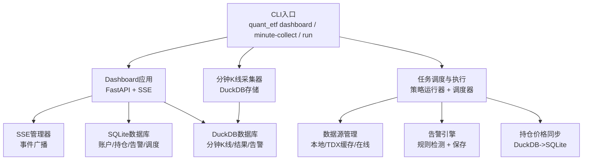
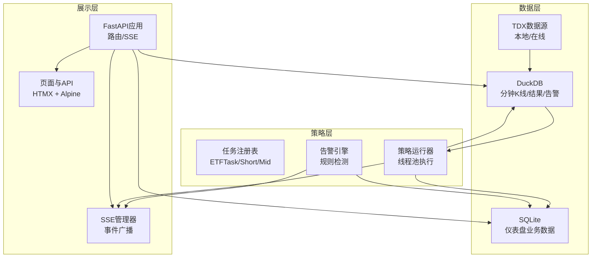
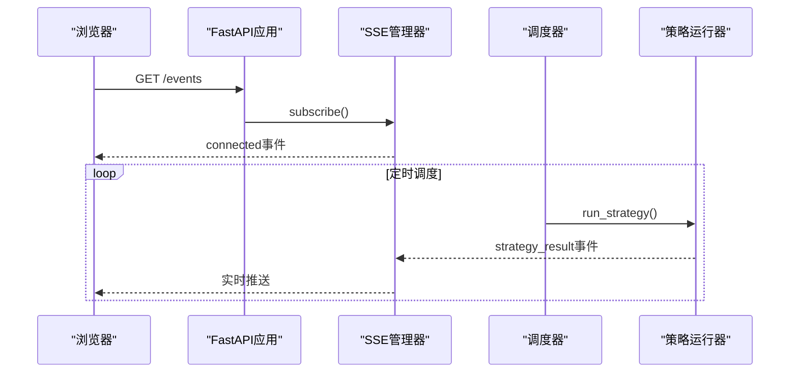
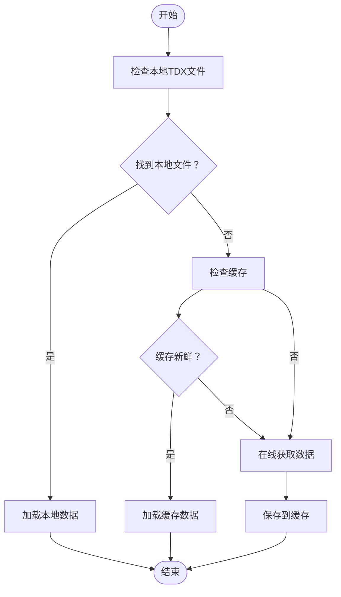
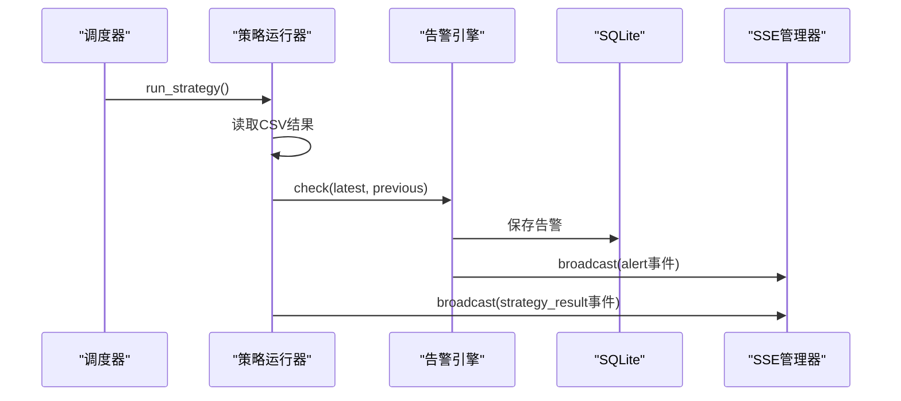
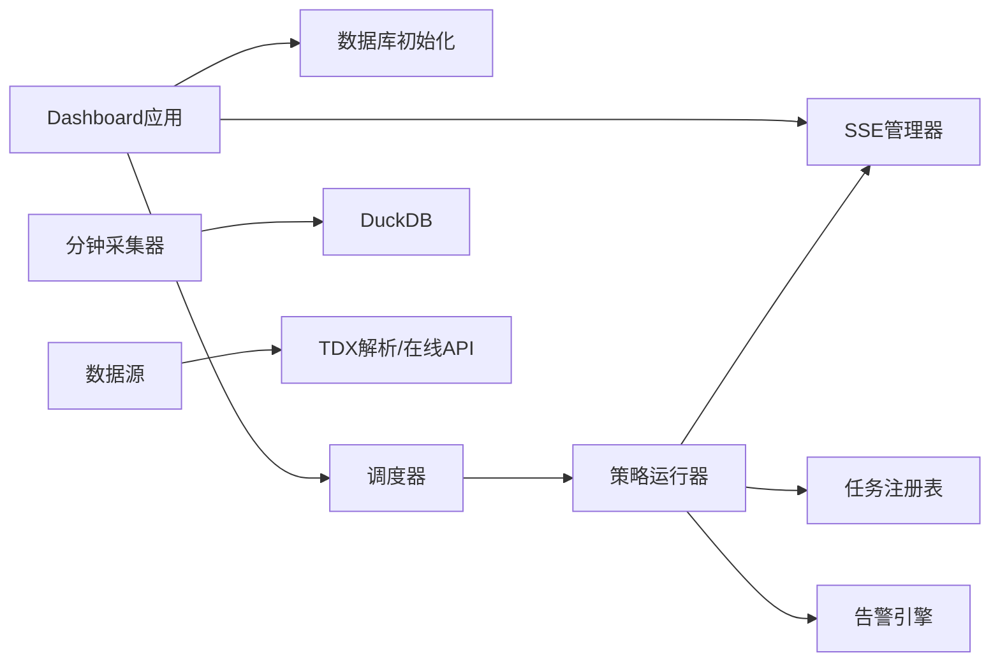

# 故障排除指南

<cite>
**本文档引用的文件**
- [README.md](file://README.md)
- [app.py](file://src/quant_etf/dashboard/app.py)
- [sse_manager.py](file://src/quant_etf/dashboard/services/sse_manager.py)
- [db.py](file://src/quant_etf/dashboard/db.py)
- [config.py](file://src/quant_etf/dashboard/config.py)
- [alert_engine.py](file://src/quant_etf/dashboard/services/alert_engine.py)
- [strategy_runner.py](file://src/quant_etf/dashboard/services/strategy_runner.py)
- [scheduler.py](file://src/quant_etf/dashboard/services/scheduler.py)
- [portfolio_sync.py](file://src/quant_etf/dashboard/services/portfolio_sync.py)
- [data_source.py](file://src/quant_etf/data_source.py)
- [tasks.py](file://src/quant_etf/tasks.py)
- [minute_collector.py](file://src/quant_etf/minute_collector.py)
- [test_data_source.py](file://tests/test_data_source.py)
</cite>

## 目录
1. [简介](#简介)
2. [项目结构](#项目结构)
3. [核心组件](#核心组件)
4. [架构总览](#架构总览)
5. [详细组件分析](#详细组件分析)
6. [依赖关系分析](#依赖关系分析)
7. [性能考虑](#性能考虑)
8. [故障排除指南](#故障排除指南)
9. [结论](#结论)
10. [附录](#附录)

## 简介
本指南面向Quant-ETF项目的运维与开发人员，提供系统化的故障排除方法与最佳实践。涵盖数据采集失败、Dashboard连接问题、策略执行错误、日志分析技巧、性能问题排查、网络连接问题、数据库异常与数据一致性、SSE实时推送故障、系统资源与性能瓶颈诊断、紧急恢复流程以及故障预防与预警配置。

## 项目结构
项目采用模块化设计，核心分为数据层（TDX数据源、分钟K线采集）、策略层（任务调度与执行）、仪表盘层（FastAPI + SSE + SQLite/DuckDB）。关键入口与组件如下：
- CLI统一入口：通过命令行子命令驱动各模块
- Dashboard：FastAPI应用，提供页面路由与SSE事件流
- 数据采集：分钟K线采集器，使用DuckDB存储
- 策略执行：任务注册表与策略运行器，支持告警引擎集成
- 数据源：ETF/股票数据加载，支持本地TDX文件、缓存与在线回退

**图示来源**
- [README.md](file://README.md)
- [app.py](file://src/quant_etf/dashboard/app.py)
- [minute_collector.py](file://src/quant_etf/minute_collector.py)
- [tasks.py](file://src/quant_etf/tasks.py)
- [data_source.py](file://src/quant_etf/data_source.py)

**章节来源**
- [README.md](file://README.md)
- [app.py](file://src/quant_etf/dashboard/app.py)

## 核心组件
- Dashboard应用与SSE：提供Web界面与实时事件推送，支持健康检查与优雅关闭
- 数据库层：SQLite用于仪表盘业务数据，DuckDB用于分钟K线、结果与告警
- 数据源与采集：ETF/股票数据加载，分钟K线采集与存储
- 策略执行与告警：任务执行、结果对比、告警生成与SSE广播
- 调度与同步：定时任务调度、持仓价格同步

**章节来源**
- [app.py](file://src/quant_etf/dashboard/app.py)
- [db.py](file://src/quant_etf/dashboard/db.py)
- [config.py](file://src/quant_etf/dashboard/config.py)
- [data_source.py](file://src/quant_etf/data_source.py)
- [minute_collector.py](file://src/quant_etf/minute_collector.py)
- [tasks.py](file://src/quant_etf/tasks.py)
- [alert_engine.py](file://src/quant_etf/dashboard/services/alert_engine.py)
- [strategy_runner.py](file://src/quant_etf/dashboard/services/strategy_runner.py)
- [scheduler.py](file://src/quant_etf/dashboard/services/scheduler.py)
- [portfolio_sync.py](file://src/quant_etf/dashboard/services/portfolio_sync.py)

## 架构总览
系统采用“数据采集-策略执行-仪表盘展示”的三层架构，数据流从TDX/在线数据源流向DuckDB，策略执行结果与告警写入SQLite/DuckDB，Dashboard通过SSE实时推送事件。

**图示来源**
- [README.md](file://README.md)
- [app.py](file://src/quant_etf/dashboard/app.py)
- [tasks.py](file://src/quant_etf/tasks.py)
- [alert_engine.py](file://src/quant_etf/dashboard/services/alert_engine.py)
- [strategy_runner.py](file://src/quant_etf/dashboard/services/strategy_runner.py)
- [db.py](file://src/quant_etf/dashboard/db.py)
- [config.py](file://src/quant_etf/dashboard/config.py)

## 详细组件分析

### Dashboard应用与SSE管理
- 应用启动/关闭钩子负责数据库初始化与调度器启动/停止
- SSE端点返回Server-Sent Events流，心跳保活，客户端断开自动清理
- 异常处理器统一返回JSON错误响应

**图示来源**
- [app.py](file://src/quant_etf/dashboard/app.py)
- [sse_manager.py](file://src/quant_etf/dashboard/services/sse_manager.py)
- [scheduler.py](file://src/quant_etf/dashboard/services/scheduler.py)
- [strategy_runner.py](file://src/quant_etf/dashboard/services/strategy_runner.py)

**章节来源**
- [app.py](file://src/quant_etf/dashboard/app.py)
- [sse_manager.py](file://src/quant_etf/dashboard/services/sse_manager.py)

### 数据源与采集
- 数据源优先级：本地TDX文件 → 缓存 → 在线获取；支持名称映射缓存与新鲜度检查
- 分钟K线采集器：自动选择可用服务器、冷却失败服务器、交易时间判断、DuckDB存储
- 错误处理：连接失败、无数据返回、保存失败均有日志记录

**图示来源**
- [data_source.py](file://src/quant_etf/data_source.py)
- [minute_collector.py](file://src/quant_etf/minute_collector.py)

**章节来源**
- [data_source.py](file://src/quant_etf/data_source.py)
- [minute_collector.py](file://src/quant_etf/minute_collector.py)

### 策略执行与告警
- 策略运行器在后台线程执行任务，完成后读取CSV结果，对比上一次结果触发告警
- 告警引擎包含“进入前三”、“动量突变”等规则，保存到SQLite并广播SSE事件
- 调度器启动定时循环，每次执行后广播结果事件

**图示来源**
- [strategy_runner.py](file://src/quant_etf/dashboard/services/strategy_runner.py)
- [alert_engine.py](file://src/quant_etf/dashboard/services/alert_engine.py)
- [db.py](file://src/quant_etf/dashboard/db.py)
- [sse_manager.py](file://src/quant_etf/dashboard/services/sse_manager.py)

**章节来源**
- [strategy_runner.py](file://src/quant_etf/dashboard/services/strategy_runner.py)
- [alert_engine.py](file://src/quant_etf/dashboard/services/alert_engine.py)
- [scheduler.py](file://src/quant_etf/dashboard/services/scheduler.py)

### 数据库与一致性
- SQLite用于仪表盘业务数据（账户、持仓、告警规则、调度配置），WAL模式与外键约束提升可靠性
- DuckDB用于分钟K线、策略结果与告警，提供高性能查询与分析能力
- 数据一致性通过事务提交与异常捕获保障

**章节来源**
- [db.py](file://src/quant_etf/dashboard/db.py)
- [config.py](file://src/quant_etf/dashboard/config.py)

## 依赖关系分析
- Dashboard应用依赖SSE管理器、调度器与数据库初始化
- 策略运行器依赖任务注册表、告警引擎与SSE管理器
- 分钟采集器依赖DuckDB与TDX行情API
- 数据源依赖TDX解析与在线API

**图示来源**
- [app.py](file://src/quant_etf/dashboard/app.py)
- [scheduler.py](file://src/quant_etf/dashboard/services/scheduler.py)
- [strategy_runner.py](file://src/quant_etf/dashboard/services/strategy_runner.py)
- [minute_collector.py](file://src/quant_etf/minute_collector.py)
- [data_source.py](file://src/quant_etf/data_source.py)

**章节来源**
- [app.py](file://src/quant_etf/dashboard/app.py)
- [tasks.py](file://src/quant_etf/tasks.py)
- [minute_collector.py](file://src/quant_etf/minute_collector.py)
- [data_source.py](file://src/quant_etf/data_source.py)

## 性能考虑
- 数据库优化：SQLite使用WAL模式与外键约束；DuckDB提供索引与分区查询能力
- 线程池：策略运行器使用线程池执行耗时任务，避免阻塞事件循环
- SSE心跳：30秒心跳保活，减少连接中断影响
- 采集节流：分钟采集器对失败服务器进行冷却，降低请求压力

**章节来源**
- [db.py](file://src/quant_etf/dashboard/db.py)
- [strategy_runner.py](file://src/quant_etf/dashboard/services/strategy_runner.py)
- [sse_manager.py](file://src/quant_etf/dashboard/services/sse_manager.py)
- [minute_collector.py](file://src/quant_etf/minute_collector.py)

## 故障排除指南

### 1. 数据采集失败
- 现象：分钟K线无法采集或保存失败
- 诊断步骤：
  - 检查交易时间：仅在交易时段采集
  - 检查服务器连通性：确认TDX行情服务器可用，失败服务器进入冷却
  - 检查DuckDB连接：确认数据库文件存在且可写
  - 查看日志：关注连接失败、无数据返回、保存异常
- 解决方案：
  - 更换服务器或稍后再试
  - 重建DuckDB表结构与索引
  - 检查磁盘空间与权限

**章节来源**
- [minute_collector.py](file://src/quant_etf/minute_collector.py)
- [README.md](file://README.md)

### 2. Dashboard连接问题
- 现象：页面无法加载或SSE连接中断
- 诊断步骤：
  - 健康检查：使用CLI健康检查命令验证端口与路由
  - 端口占用：确认监听端口未被占用
  - 热重载：禁用热重载以排除开发模式干扰
  - 异常处理：查看通用异常处理器返回的错误详情
- 解决方案：
  - 更换端口或主机地址
  - 重启服务并执行一键重启命令
  - 检查防火墙与代理设置

**章节来源**
- [README.md](file://README.md)
- [app.py](file://src/quant_etf/dashboard/app.py)

### 3. 策略执行错误
- 现象：策略运行失败，SSE广播错误事件
- 诊断步骤：
  - 检查任务注册表：确认任务名称有效
  - 检查CSV结果：确认当日结果文件存在且格式正确
  - 检查告警对比：确认上一次结果可加载
  - 查看线程池与事件循环：确保SSE广播在主线程中执行
- 解决方案：
  - 修正任务配置或数据路径
  - 手动触发一次策略执行以生成结果
  - 检查日志中的错误堆栈并定位异常

**章节来源**
- [tasks.py](file://src/quant_etf/tasks.py)
- [strategy_runner.py](file://src/quant_etf/dashboard/services/strategy_runner.py)
- [scheduler.py](file://src/quant_etf/dashboard/services/scheduler.py)

### 4. 日志分析技巧与错误定位
- 日志位置：项目使用loguru记录，日志文件位于logs目录
- 分析方法：
  - 按时间范围筛选：结合CLI输出与系统时间定位问题发生时刻
  - 关键词搜索：连接失败、保存异常、无数据返回、广播失败
  - 上下文关联：将采集、执行、推送三个环节的日志串联分析
- 常见错误模式：
  - 采集器：服务器冷却、连接超时
  - 执行器：CSV读取失败、告警对比异常
  - SSE：广播失败、客户端断开

**章节来源**
- [README.md](file://README.md)
- [minute_collector.py](file://src/quant_etf/minute_collector.py)
- [strategy_runner.py](file://src/quant_etf/dashboard/services/strategy_runner.py)
- [sse_manager.py](file://src/quant_etf/dashboard/services/sse_manager.py)

### 5. 性能问题排查
- 慢查询识别：
  - 分钟K线查询：检查SQL条件与索引使用
  - 结果对比：确认CSV文件大小与读取路径
- 内存泄漏检测：
  - 监控进程内存：观察长时间运行后的内存增长
  - 关闭数据库连接：确保采集器与同步服务正确关闭连接
- 工具建议：
  - 使用数据库分析工具检查查询计划
  - 使用系统监控工具观察CPU与内存占用

**章节来源**
- [minute_collector.py](file://src/quant_etf/minute_collector.py)
- [portfolio_sync.py](file://src/quant_etf/dashboard/services/portfolio_sync.py)
- [db.py](file://src/quant_etf/dashboard/db.py)

### 6. 网络连接问题
- 现象：在线数据获取失败、SSE连接不稳定
- 诊断步骤：
  - 检查DNS与代理：确认网络可达性
  - 服务器切换：分钟采集器会自动切换可用服务器
  - 心跳保活：SSE心跳每30秒一次，检查客户端网络状况
- 解决方案：
  - 配置代理或更换网络环境
  - 调整服务器冷却时间与重试策略

**章节来源**
- [minute_collector.py](file://src/quant_etf/minute_collector.py)
- [data_source.py](file://src/quant_etf/data_source.py)
- [sse_manager.py](file://src/quant_etf/dashboard/services/sse_manager.py)

### 7. 数据库连接异常与数据一致性
- SQLite异常：
  - WAL模式与外键约束：确保事务正确提交
  - 连接池：避免并发写入冲突
- DuckDB异常：
  - 表结构与索引：重建分钟K线表与索引
  - 只读连接：价格同步使用只读连接，避免写锁
- 数据一致性：
  - 任务执行后对比CSV结果，确保告警生成
  - 持仓价格同步统计：更新/跳过/错误计数

**章节来源**
- [db.py](file://src/quant_etf/dashboard/db.py)
- [config.py](file://src/quant_etf/dashboard/config.py)
- [portfolio_sync.py](file://src/quant_etf/dashboard/services/portfolio_sync.py)

### 8. SSE实时推送故障
- 现象：浏览器无法接收实时事件
- 诊断步骤：
  - 检查SSE端点：确认路由与响应头设置
  - 检查队列管理：确认订阅队列存在与断开清理
  - 检查广播：确认事件类型与数据结构
- 解决方案：
  - 重启Dashboard以重建SSE连接
  - 检查客户端EventSource实现与网络状况

**章节来源**
- [app.py](file://src/quant_etf/dashboard/app.py)
- [sse_manager.py](file://src/quant_etf/dashboard/services/sse_manager.py)

### 9. 系统资源不足与性能瓶颈
- CPU/内存监控：观察长时间运行后的资源消耗
- 数据库压力：DuckDB写入与查询负载评估
- 策略执行：线程池大小与任务复杂度平衡
- 建议：
  - 限制并发任务数量
  - 优化查询与索引
  - 增加系统资源或拆分部署

**章节来源**
- [strategy_runner.py](file://src/quant_etf/dashboard/services/strategy_runner.py)
- [minute_collector.py](file://src/quant_etf/minute_collector.py)
- [db.py](file://src/quant_etf/dashboard/db.py)

### 10. 紧急恢复流程与应急响应
- 快速恢复：
  - 一键重启Dashboard服务
  - 重新初始化数据库表
  - 重新启动调度器
- 应急响应：
  - 健康检查：定期验证各路由与SSE端点
  - 备份策略：定期备份DuckDB与SQLite数据
  - 回滚机制：回退到上一个稳定版本

**章节来源**
- [README.md](file://README.md)
- [app.py](file://src/quant_etf/dashboard/app.py)
- [db.py](file://src/quant_etf/dashboard/db.py)

### 11. 故障预防与预警机制
- 配置建议：
  - 调整SSE心跳间隔与告警阈值
  - 设置服务器冷却时间与重试次数
  - 监控关键指标：采集成功率、执行时长、SSE连接数
- 预警策略：
  - 告警规则：动量突变、进入前三等
  - 健康检查：自动化路由检查与SSE连通性测试

**章节来源**
- [config.py](file://src/quant_etf/dashboard/config.py)
- [alert_engine.py](file://src/quant_etf/dashboard/services/alert_engine.py)
- [README.md](file://README.md)

## 结论
本指南提供了从数据采集、策略执行到仪表盘展示的全链路故障排除方法。通过日志分析、性能监控与配置优化，可有效定位并解决常见问题。建议在生产环境中实施健康检查、备份与回滚机制，确保系统稳定运行。

## 附录

### 常用命令与端口
- Dashboard启动与重启：使用CLI命令启动/重启服务
- 健康检查：验证各页面路由与SSE端点
- 端口与主机：可通过环境变量配置监听地址与端口

**章节来源**
- [README.md](file://README.md)