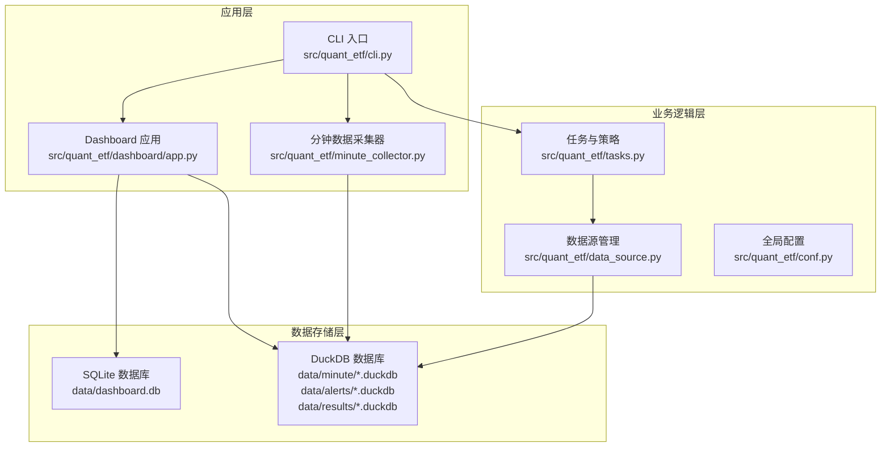
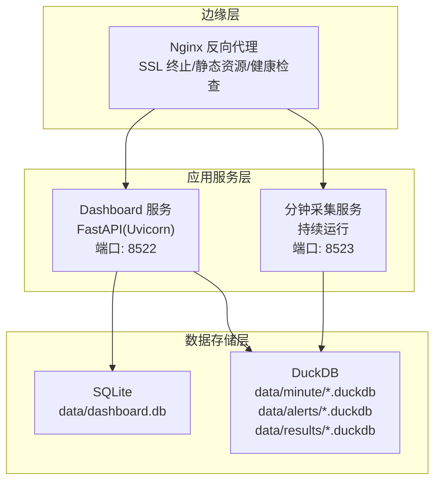
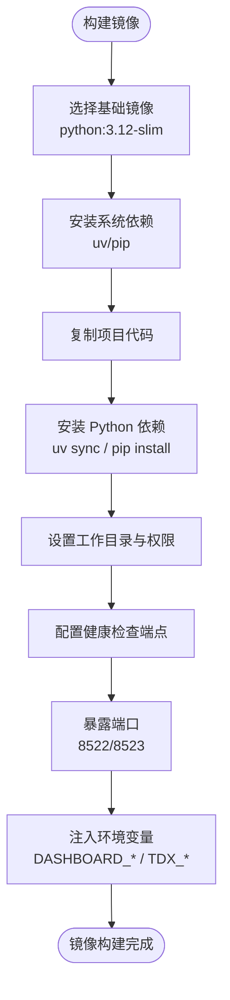
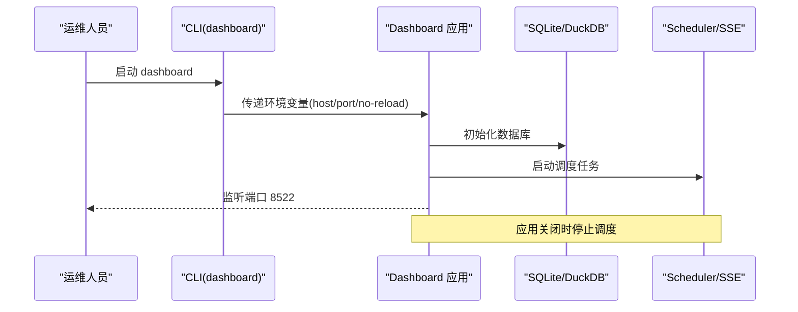
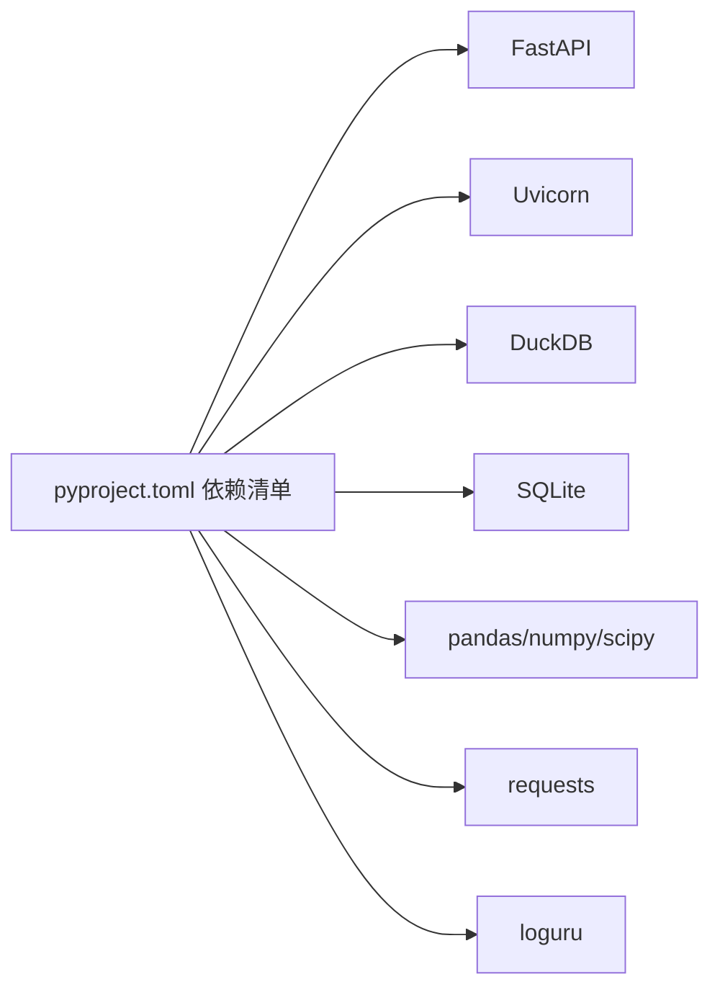

# 生产环境部署

<cite>
**本文档引用的文件**
- [README.md](file://README.md)
- [DEVELOPMENT.md](file://DEVELOPMENT.md)
- [pyproject.toml](file://pyproject.toml)
- [src/quant_etf/cli.py](file://src/quant_etf/cli.py)
- [src/quant_etf/conf.py](file://src/quant_etf/conf.py)
- [src/quant_etf/data_source.py](file://src/quant_etf/data_source.py)
- [src/quant_etf/tasks.py](file://src/quant_etf/tasks.py)
- [src/quant_etf/dashboard/app.py](file://src/quant_etf/dashboard/app.py)
- [src/quant_etf/dashboard/config.py](file://src/quant_etf/dashboard/config.py)
- [src/quant_etf/dashboard/db.py](file://src/quant_etf/dashboard/db.py)
- [src/quant_etf/dashboard/services/scheduler.py](file://src/quant_etf/dashboard/services/scheduler.py)
- [src/quant_etf/dashboard/services/sse_manager.py](file://src/quant_etf/dashboard/services/sse_manager.py)
- [docs/superpowers/specs/2026-05-21-dashboard-audit.md](file://docs/superpowers/specs/2026-05-21-dashboard-audit.md)
</cite>

## 目录
1. [简介](#简介)
2. [项目结构](#项目结构)
3. [核心组件](#核心组件)
4. [架构总览](#架构总览)
5. [详细组件分析](#详细组件分析)
6. [依赖分析](#依赖分析)
7. [性能考虑](#性能考虑)
8. [故障排除指南](#故障排除指南)
9. [结论](#结论)
10. [附录](#附录)

## 简介
本指南面向生产环境部署 Quant-ETF 项目，涵盖部署架构设计、容器化方案、环境变量配置、数据库与缓存设置、进程管理与启动顺序、负载均衡与高可用、以及安全与防火墙最佳实践。项目基于动量策略的 ETF 选股工具，提供统一 CLI、Dashboard 监控系统（FastAPI + Uvicorn + SQLite/DuckDB + SSE）以及分钟级数据采集器。

## 项目结构
项目采用模块化组织，核心模块包括：
- CLI 统一入口与子命令（daily-run、dashboard、minute-collect、backfill 等）
- 数据源与 TDX 集成（本地文件、缓存、在线获取）
- 选股任务与策略引擎（ETF、短线、中线）
- Dashboard 监控系统（FastAPI + SSE + SQLite/DuckDB）
- 服务调度与实时事件推送（Scheduler + SSE Manager）

**图示来源**
- [src/quant_etf/cli.py:1-403](file://src/quant_etf/cli.py#L1-L403)
- [src/quant_etf/dashboard/app.py:1-87](file://src/quant_etf/dashboard/app.py#L1-L87)
- [src/quant_etf/tasks.py:1-467](file://src/quant_etf/tasks.py#L1-L467)
- [src/quant_etf/data_source.py:1-381](file://src/quant_etf/data_source.py#L1-L381)
- [src/quant_etf/conf.py:1-137](file://src/quant_etf/conf.py#L1-L137)

**章节来源**
- [README.md:253-276](file://README.md#L253-L276)
- [DEVELOPMENT.md:47-74](file://DEVELOPMENT.md#L47-L74)

## 核心组件
- CLI 统一入口：提供 daily-run、dashboard、minute-collect、backfill、restart-dashboard、run、list-tasks、check、backfill-stock-names 等子命令，集中管理各模块入口与参数解析。
- Dashboard 应用：基于 FastAPI + Uvicorn，提供页面路由与 API 路由，启动时初始化数据库并恢复调度任务，关闭时停止调度。
- 数据源管理：实现本地 TDX 文件、缓存、在线数据三层加载策略，支持 ETF 与股票数据加载与名称映射缓存。
- 任务与策略：定义 ETF、短线、中线选股任务，执行策略打分与结果导出，支持 CSV 与 TDX 导入文件生成。
- SSE 实时推送：维护客户端连接队列，心跳保活，广播策略执行结果与错误事件。
- 数据存储：SQLite 存储账户、持仓、告警规则、调度配置；DuckDB 存储分钟级 K 线、结果与告警信号。

**章节来源**
- [src/quant_etf/cli.py:1-403](file://src/quant_etf/cli.py#L1-L403)
- [src/quant_etf/dashboard/app.py:1-87](file://src/quant_etf/dashboard/app.py#L1-L87)
- [src/quant_etf/data_source.py:1-381](file://src/quant_etf/data_source.py#L1-L381)
- [src/quant_etf/tasks.py:1-467](file://src/quant_etf/tasks.py#L1-L467)
- [src/quant_etf/dashboard/services/sse_manager.py:1-45](file://src/quant_etf/dashboard/services/sse_manager.py#L1-L45)
- [src/quant_etf/dashboard/db.py:1-133](file://src/quant_etf/dashboard/db.py#L1-L133)

## 架构总览
生产环境建议采用多容器编排，分离 Dashboard、数据采集器与数据库服务，结合反向代理与 SSL 终止，实现高可用与弹性伸缩。

**图示来源**
- [src/quant_etf/dashboard/app.py:74-87](file://src/quant_etf/dashboard/app.py#L74-L87)
- [src/quant_etf/dashboard/config.py:16-25](file://src/quant_etf/dashboard/config.py#L16-L25)
- [src/quant_etf/dashboard/db.py:1-133](file://src/quant_etf/dashboard/db.py#L1-L133)

## 详细组件分析

### Docker 容器化部署方案
- 基础镜像选择：建议使用官方 Python 运行时镜像（如 python:3.12-slim），确保依赖与运行时一致。
- 依赖安装：使用项目配置中的依赖清单，优先使用 uv（如已配置）以提升安装速度与确定性。
- 工作目录与权限：设置工作目录为项目根目录，确保 data、logs 目录具备写权限。
- 健康检查：提供 HTTP 健康检查端点，用于容器编排平台的存活/就绪探针。
- 环境变量：通过环境变量注入 DASHBOARD_HOST、DASHBOARD_PORT、TDX_DATA_PATH 等配置。

**图示来源**
- [pyproject.toml:1-53](file://pyproject.toml#L1-L53)
- [src/quant_etf/dashboard/config.py:16-25](file://src/quant_etf/dashboard/config.py#L16-L25)
- [src/quant_etf/conf.py:100-117](file://src/quant_etf/conf.py#L100-L117)

**章节来源**
- [pyproject.toml:1-53](file://pyproject.toml#L1-L53)
- [src/quant_etf/dashboard/config.py:16-25](file://src/quant_etf/dashboard/config.py#L16-L25)
- [src/quant_etf/conf.py:100-117](file://src/quant_etf/conf.py#L100-L117)

### docker-compose 配置要点
- 服务定义：定义 dashboard 与 minute-collect 两个服务，分别映射不同端口。
- 卷挂载：挂载 data、logs 目录至宿主机持久化存储，确保 DuckDB 与 SQLite 数据持久化。
- 环境变量：通过 env_file 或 environment 字段注入 DASHBOARD_HOST、DASHBOARD_PORT、TDX_DATA_PATH。
- 网络：使用自定义网络隔离服务，便于服务间通信与外部访问控制。
- 健康检查：为 dashboard 服务配置 HTTP 健康检查，确保反向代理仅转发健康实例。

**章节来源**
- [src/quant_etf/dashboard/app.py:74-87](file://src/quant_etf/dashboard/app.py#L74-L87)
- [src/quant_etf/dashboard/config.py:16-25](file://src/quant_etf/dashboard/config.py#L16-L25)
- [src/quant_etf/conf.py:100-117](file://src/quant_etf/conf.py#L100-L117)

### 环境变量配置说明
- Dashboard 监听配置
  - DASHBOARD_HOST：监听地址，默认 127.0.0.1
  - DASHBOARD_PORT：监听端口，默认 8522
- 数据源配置
  - TDX_DATA_PATH：通达信数据目录路径（Windows 默认 C:\new_hxzq_hc，Linux 默认 ~/.local/share/tdx）
- CLI 控制
  - DASHBOARD_RELOAD：是否启用热重载（dashboard 子命令支持）

**章节来源**
- [src/quant_etf/dashboard/config.py:16-25](file://src/quant_etf/dashboard/config.py#L16-L25)
- [src/quant_etf/conf.py:100-117](file://src/quant_etf/conf.py#L100-L117)
- [src/quant_etf/cli.py:72-84](file://src/quant_etf/cli.py#L72-L84)

### 依赖管理策略
- 依赖清单：pyproject.toml 中声明了核心依赖（FastAPI、Uvicorn、DuckDB、SQLite、pandas、numpy 等）。
- 索引与源：配置阿里云与清华源作为默认与备用索引，提升安装稳定性。
- 开发依赖：pytest 等开发工具通过依赖组管理，便于本地开发与 CI 场景。

**章节来源**
- [pyproject.toml:1-53](file://pyproject.toml#L1-L53)

### Nginx 反向代理与 SSL 证书
- 反向代理：将外部请求转发至 Dashboard 与分钟采集服务，支持静态资源缓存与 Gzip 压缩。
- SSL 终止：在 Nginx 层完成 TLS 终止，证书与密钥文件挂载至容器，支持自动续期。
- 健康检查：通过 /health 端点进行后端健康检查，仅将流量转发至健康实例。
- 超时与缓冲：合理配置 proxy_connect_timeout、proxy_send_timeout、proxy_read_timeout，避免上游超时导致的连接中断。

**章节来源**
- [src/quant_etf/dashboard/app.py:27-36](file://src/quant_etf/dashboard/app.py#L27-L36)

### 数据库连接与缓存设置
- SQLite：Dashboard 业务数据（账户、持仓、告警规则、调度配置）存储于 data/dashboard.db，使用 WAL 模式与外键约束增强一致性。
- DuckDB：分钟级 K 线、策略结果与告警信号分别存储于 data/minute/*.duckdb、data/alerts/*.duckdb、data/results/*.duckdb。
- 缓存策略：数据源优先从本地 TDX 文件加载，其次读取缓存 CSV，最后在线获取并写入缓存，确保离线可用与网络异常时的降级能力。

**章节来源**
- [src/quant_etf/dashboard/db.py:1-133](file://src/quant_etf/dashboard/db.py#L1-L133)
- [src/quant_etf/data_source.py:189-286](file://src/quant_etf/data_source.py#L189-L286)

### 进程管理与启动顺序
- Dashboard 启动：应用启动时初始化数据库并恢复已启用的调度任务；关闭时停止所有调度任务。
- CLI 启动：dashboard 子命令支持通过参数覆盖监听地址与端口，no-reload 可禁用热重载。
- 分钟采集器：持续运行，交易时段内每分钟采集 ALL_POOL 标的的 1 分钟 K 线，支持优雅退出。

**图示来源**
- [src/quant_etf/cli.py:72-84](file://src/quant_etf/cli.py#L72-L84)
- [src/quant_etf/dashboard/app.py:53-66](file://src/quant_etf/dashboard/app.py#L53-L66)
- [src/quant_etf/dashboard/services/scheduler.py:54-64](file://src/quant_etf/dashboard/services/scheduler.py#L54-L64)

**章节来源**
- [src/quant_etf/cli.py:72-84](file://src/quant_etf/cli.py#L72-L84)
- [src/quant_etf/dashboard/app.py:53-66](file://src/quant_etf/dashboard/app.py#L53-L66)
- [src/quant_etf/dashboard/services/scheduler.py:54-64](file://src/quant_etf/dashboard/services/scheduler.py#L54-L64)

### 负载均衡与高可用
- 多实例部署：Dashboard 与分钟采集器均可水平扩展，通过反向代理实现请求分发。
- 健康检查：利用 HTTP 健康检查端点，确保仅将流量转发至健康实例。
- 数据持久化：通过卷挂载确保 SQLite 与 DuckDB 数据在多实例间共享或独立副本策略。
- 会话与状态：Dashboard 依赖数据库与 SSE 实时推送，确保多实例下事件广播的一致性。

**章节来源**
- [src/quant_etf/dashboard/app.py:27-36](file://src/quant_etf/dashboard/app.py#L27-L36)

### 安全配置最佳实践与防火墙规则
- 网络访问控制：Dashboard 默认监听 127.0.0.1，生产环境建议通过反向代理对外暴露，限制直接访问。
- 端口开放：仅开放反向代理端口（如 80/443），内部服务间通过容器网络通信。
- 证书管理：在 Nginx 层完成 SSL 终止，定期更新证书与密钥，启用强密码套件与协议版本。
- 日志与审计：启用应用日志与访问日志，定期轮转与归档，避免敏感信息泄露。
- 权限最小化：容器以非 root 用户运行，仅授予必要的文件系统权限。

**章节来源**
- [src/quant_etf/dashboard/config.py:16-25](file://src/quant_etf/dashboard/config.py#L16-L25)

## 依赖分析
项目依赖主要分为运行时与开发时两类，运行时依赖包括 Web 框架、数据库、数据处理与实时推送等模块。

**图示来源**
- [pyproject.toml:7-22](file://pyproject.toml#L7-L22)

**章节来源**
- [pyproject.toml:1-53](file://pyproject.toml#L1-L53)

## 性能考虑
- 数据加载优化：优先使用本地 TDX 文件与缓存，减少在线请求延迟；对大型数据集使用 DuckDB 列式存储与查询优化。
- SSE 心跳：维持合理的心跳间隔（默认 30 秒），避免过多空闲消息占用带宽。
- 并发与异步：使用 asyncio 管理调度与事件广播，避免阻塞主线程。
- 资源限制：在容器编排中设置 CPU/内存限制，防止资源争用影响整体稳定性。

## 故障排除指南
- Dashboard 健康检查：通过 CLI 的 check 子命令验证页面路由可用性，定位服务异常。
- 进程管理：使用 restart-dashboard 子命令一键重启服务，先终止旧进程再启动新进程。
- 数据库初始化：确认数据库初始化脚本执行成功，检查 data/dashboard.db 是否存在。
- 环境变量：核对 DASHBOARD_HOST、DASHBOARD_PORT、TDX_DATA_PATH 是否正确设置。

**章节来源**
- [src/quant_etf/cli.py:189-255](file://src/quant_etf/cli.py#L189-L255)
- [src/quant_etf/cli.py:309-322](file://src/quant_etf/cli.py#L309-L322)
- [src/quant_etf/dashboard/db.py:79-91](file://src/quant_etf/dashboard/db.py#L79-L91)

## 结论
通过容器化与反向代理的生产部署方案，结合 SQLite 与 DuckDB 的混合存储策略、SSE 实时推送与完善的环境变量配置，Quant-ETF 项目可在生产环境中实现稳定、可扩展与可观测的运行。建议在上线前完成健康检查与安全加固，并制定滚动发布与回滚预案。

## 附录
- 项目入口与命令：CLI 提供统一入口，支持多种子命令与参数控制。
- 数据流全景：TDX 数据经分钟采集器写入 DuckDB，策略执行结果与告警信号通过 SSE 推送至 Dashboard。

**章节来源**
- [README.md:319-590](file://README.md#L319-L590)