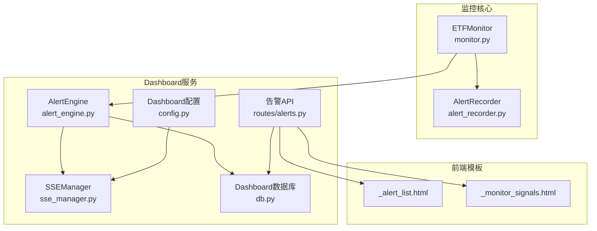
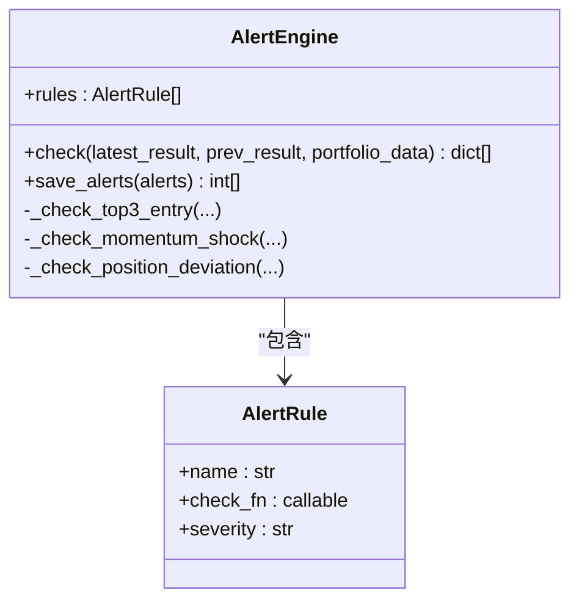
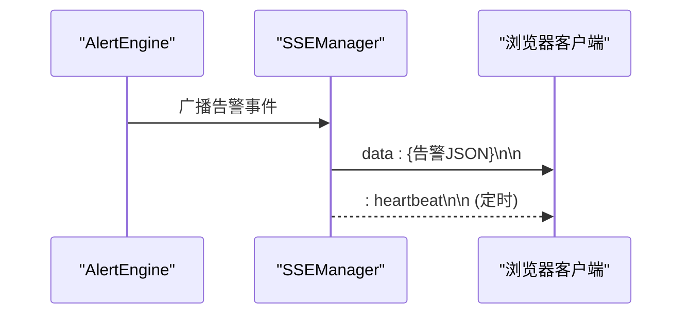
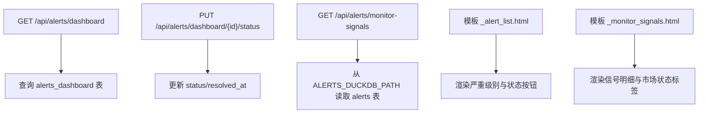
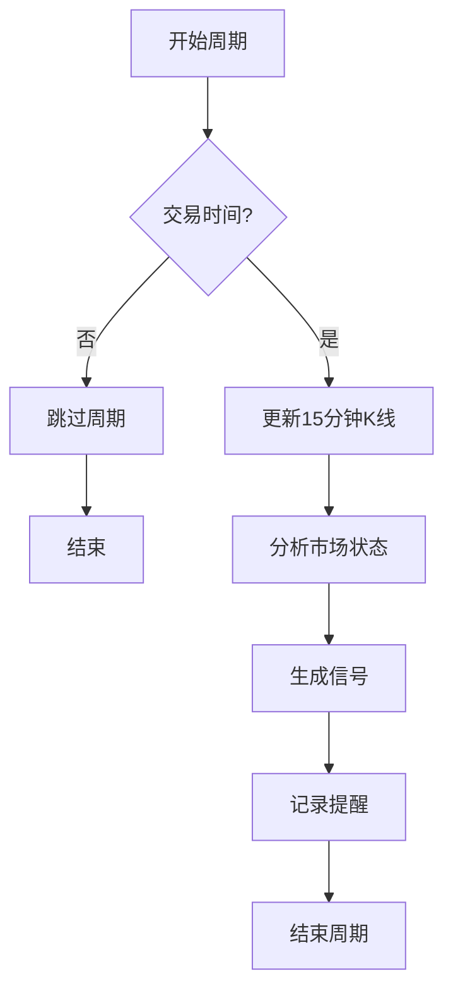
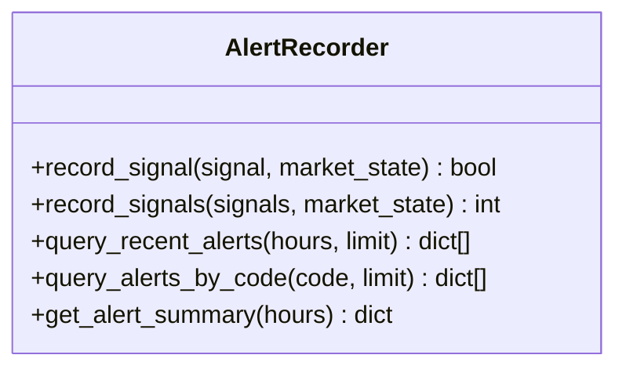
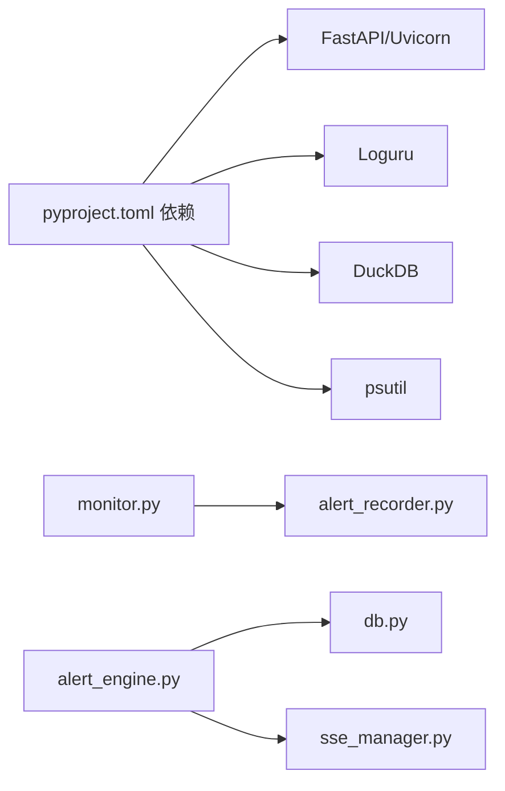

# 监控和告警配置

<cite>
**本文引用的文件**
- [alert_engine.py](file://src/quant_etf/dashboard/services/alert_engine.py)
- [sse_manager.py](file://src/quant_etf/dashboard/services/sse_manager.py)
- [alerts.py](file://src/quant_etf/dashboard/routes/alerts.py)
- [monitor.py](file://src/quant_etf/monitor.py)
- [alert_recorder.py](file://src/quant_etf/alert_recorder.py)
- [config.py](file://src/quant_etf/dashboard/config.py)
- [db.py](file://src/quant_etf/dashboard/db.py)
- [models.py](file://src/quant_etf/dashboard/models.py)
- [_alert_list.html](file://src/quant_etf/dashboard/templates/alerts/_alert_list.html)
- [_monitor_signals.html](file://src/quant_etf/dashboard/templates/alerts/_monitor_signals.html)
- [conf.py](file://src/quant_etf/conf.py)
- [pyproject.toml](file://pyproject.toml)
</cite>

## 目录
1. [简介](#简介)
2. [项目结构](#项目结构)
3. [核心组件](#核心组件)
4. [架构总览](#架构总览)
5. [详细组件分析](#详细组件分析)
6. [依赖分析](#依赖分析)
7. [性能考虑](#性能考虑)
8. [故障排查指南](#故障排查指南)
9. [结论](#结论)
10. [附录](#附录)

## 简介
本文件面向Quant-ETF项目的监控与告警体系，系统化说明以下内容：
- 实时监控指标与采集方式：包括策略信号、市场状态、风险度量等
- 日志管理：Loguru日志级别、日志轮转与集中化收集建议
- SSE事件流监控与实时告警推送
- 告警规则与阈值配置：当前内置规则与扩展点
- 告警通知渠道：邮件、短信、企业微信的集成建议
- 监控仪表板：看板服务、路由、模板与自定义指标
- 故障自动恢复与健康检查：运行时保护与降级策略
- 性能基线与异常检测：阈值设定与检测策略

## 项目结构
监控与告警相关模块主要分布在以下位置：
- 实时监控与信号记录：monitor.py、alert_recorder.py
- Dashboard与告警引擎：dashboard/services/*、routes/alerts.py、templates/alerts/*
- 配置与数据库：dashboard/config.py、dashboard/db.py、dashboard/models.py
- 通用配置：conf.py
- 依赖声明：pyproject.toml



图表来源
- [monitor.py:1-242](file://src/quant_etf/monitor.py#L1-L242)
- [alert_recorder.py:1-233](file://src/quant_etf/alert_recorder.py#L1-L233)
- [alert_engine.py:1-120](file://src/quant_etf/dashboard/services/alert_engine.py#L1-L120)
- [sse_manager.py:1-45](file://src/quant_etf/dashboard/services/sse_manager.py#L1-L45)
- [alerts.py:1-105](file://src/quant_etf/dashboard/routes/alerts.py#L1-L105)
- [db.py:1-133](file://src/quant_etf/dashboard/db.py#L1-L133)
- [config.py:1-25](file://src/quant_etf/dashboard/config.py#L1-L25)
- [_alert_list.html:1-69](file://src/quant_etf/dashboard/templates/alerts/_alert_list.html#L1-L69)
- [_monitor_signals.html:1-69](file://src/quant_etf/dashboard/templates/alerts/_monitor_signals.html#L1-L69)

章节来源
- [monitor.py:1-242](file://src/quant_etf/monitor.py#L1-L242)
- [alert_recorder.py:1-233](file://src/quant_etf/alert_recorder.py#L1-L233)
- [alert_engine.py:1-120](file://src/quant_etf/dashboard/services/alert_engine.py#L1-L120)
- [sse_manager.py:1-45](file://src/quant_etf/dashboard/services/sse_manager.py#L1-L45)
- [alerts.py:1-105](file://src/quant_etf/dashboard/routes/alerts.py#L1-L105)
- [db.py:1-133](file://src/quant_etf/dashboard/db.py#L1-L133)
- [config.py:1-25](file://src/quant_etf/dashboard/config.py#L1-L25)
- [_alert_list.html:1-69](file://src/quant_etf/dashboard/templates/alerts/_alert_list.html#L1-L69)
- [_monitor_signals.html:1-69](file://src/quant_etf/dashboard/templates/alerts/_monitor_signals.html#L1-L69)

## 核心组件
- ETFMonitor：负责周期性拉取1分钟K线、更新15分钟K线、分析市场状态、生成交易信号、记录提醒，并在Dashboard侧触发告警。
- AlertRecorder：将策略信号持久化至DuckDB，便于历史回溯与统计分析。
- AlertEngine：内置告警规则检测（如“进入前三”、“动量突变”、“持仓偏离”），并将告警写入Dashboard数据库。
- SSEManager：提供Server-Sent Events事件流，用于实时向浏览器推送告警与心跳。
- Dashboard API：提供告警规则管理、告警列表、状态变更、统计与监控信号展示等接口。
- 配置与模板：Dashboard端口、SSE心跳、阈值、数据库表结构、前端模板等。

章节来源
- [monitor.py:27-209](file://src/quant_etf/monitor.py#L27-L209)
- [alert_recorder.py:78-145](file://src/quant_etf/alert_recorder.py#L78-L145)
- [alert_engine.py:20-96](file://src/quant_etf/dashboard/services/alert_engine.py#L20-L96)
- [sse_manager.py:10-41](file://src/quant_etf/dashboard/services/sse_manager.py#L10-L41)
- [alerts.py:16-104](file://src/quant_etf/dashboard/routes/alerts.py#L16-L104)
- [db.py:11-66](file://src/quant_etf/dashboard/db.py#L11-L66)
- [config.py:16-25](file://src/quant_etf/dashboard/config.py#L16-L25)

## 架构总览
下图展示了从监控循环到Dashboard告警与SSE推送的整体流程。

```mermaid
sequenceDiagram
participant Loop as "监控循环<br/>ETFMonitor"
participant Rec as "提醒记录器<br/>AlertRecorder"
participant Eng as "告警引擎<br/>AlertEngine"
participant DashDB as "Dashboard数据库<br/>db.py"
participant API as "告警API<br/>routes/alerts.py"
participant SSE as "SSE管理器<br/>SSEManager"
Loop->>Rec : 记录策略信号
Rec-->>Loop : 写入DuckDB
Loop->>Eng : 触发规则检查
Eng->>DashDB : 写入告警记录
API->>DashDB : 查询告警列表/统计
Eng-->>SSE : 广播告警事件
SSE-->>客户端 : 推送SSE事件
```

图表来源
- [monitor.py:109-170](file://src/quant_etf/monitor.py#L109-L170)
- [alert_recorder.py:130-145](file://src/quant_etf/alert_recorder.py#L130-L145)
- [alert_engine.py:82-96](file://src/quant_etf/dashboard/services/alert_engine.py#L82-L96)
- [db.py:45-56](file://src/quant_etf/dashboard/db.py#L45-L56)
- [alerts.py:39-76](file://src/quant_etf/dashboard/routes/alerts.py#L39-L76)
- [sse_manager.py:34-41](file://src/quant_etf/dashboard/services/sse_manager.py#L34-L41)

## 详细组件分析

### 告警引擎（AlertEngine）
- 规则类型与阈值
  - “进入前三”：检测最新结果中首次进入前3的标的集合变化，触发新进入告警。
  - “动量突变”：基于上一轮与本轮评分差绝对值超过阈值的标的，触发高变动告警；当前阈值在配置中定义。
  - “持仓偏离”：预留规则，当前为空实现。
- 处理流程
  - 对比最新与上一轮结果，逐条规则执行检查，聚合告警后写入Dashboard数据库。
- 数据落库
  - 将告警标题、消息、严重级别、规则类型与附加数据持久化，支持后续状态管理与统计。



图表来源
- [alert_engine.py:13-96](file://src/quant_etf/dashboard/services/alert_engine.py#L13-L96)

章节来源
- [alert_engine.py:13-120](file://src/quant_etf/dashboard/services/alert_engine.py#L13-L120)
- [config.py:23-25](file://src/quant_etf/dashboard/config.py#L23-L25)

### SSE事件流与实时告警
- SSEManager
  - 维护订阅队列，向所有订阅者广播事件；超时发送心跳以维持连接。
- 使用场景
  - 在Dashboard侧订阅SSE，接收来自AlertEngine的告警事件，实现实时告警展示与交互。
- 心跳配置
  - 心跳间隔由Dashboard配置控制，避免连接中断。



图表来源
- [alert_engine.py:98-115](file://src/quant_etf/dashboard/services/alert_engine.py#L98-L115)
- [sse_manager.py:14-31](file://src/quant_etf/dashboard/services/sse_manager.py#L14-L31)
- [config.py:20-22](file://src/quant_etf/dashboard/config.py#L20-L22)

章节来源
- [sse_manager.py:10-45](file://src/quant_etf/dashboard/services/sse_manager.py#L10-L45)
- [config.py:20-22](file://src/quant_etf/dashboard/config.py#L20-L22)

### Dashboard API与模板
- 告警API
  - 列出/创建/删除告警规则；更新告警状态（激活/确认/解决）；统计总数与活跃数；从DuckDB读取监控信号。
- 模板
  - 告警列表模板：按严重级别与状态渲染按钮，支持HTMX在线切换状态。
  - 监控信号模板：展示最近策略信号明细，含市场状态标签。
- 数据库
  - Dashboard数据库包含账户、持仓、告警规则、告警记录与调度计划等表。



图表来源
- [alerts.py:16-104](file://src/quant_etf/dashboard/routes/alerts.py#L16-L104)
- [_alert_list.html:16-61](file://src/quant_etf/dashboard/templates/alerts/_alert_list.html#L16-L61)
- [_monitor_signals.html:18-54](file://src/quant_etf/dashboard/templates/alerts/_monitor_signals.html#L18-L54)
- [db.py:45-66](file://src/quant_etf/dashboard/db.py#L45-L66)

章节来源
- [alerts.py:16-104](file://src/quant_etf/dashboard/routes/alerts.py#L16-L104)
- [_alert_list.html:1-69](file://src/quant_etf/dashboard/templates/alerts/_alert_list.html#L1-L69)
- [_monitor_signals.html:1-69](file://src/quant_etf/dashboard/templates/alerts/_monitor_signals.html#L1-L69)
- [db.py:11-66](file://src/quant_etf/dashboard/db.py#L11-L66)

### 监控主程序（ETFMonitor）
- 周期性任务
  - 检查交易时间，更新15分钟K线，分析市场状态，生成信号，记录提醒。
- 异常处理
  - 循环内捕获异常并继续运行，保证监控稳定性。
- 参数
  - 可通过命令行设置检查间隔与ETF池大小。



图表来源
- [monitor.py:153-178](file://src/quant_etf/monitor.py#L153-L178)

章节来源
- [monitor.py:27-209](file://src/quant_etf/monitor.py#L27-L209)

### 策略信号记录（AlertRecorder）
- DuckDB存储
  - 初始化表结构并建立索引；记录字段覆盖时间、代码、策略、信号类型、方向、评分、入场/止损/止盈、原因、市场状态与均线等。
- 查询与统计
  - 支持最近N小时内的信号查询、按代码查询、统计摘要（总量、唯一标的、平均评分、买卖信号数）。



图表来源
- [alert_recorder.py:78-233](file://src/quant_etf/alert_recorder.py#L78-L233)

章节来源
- [alert_recorder.py:18-76](file://src/quant_etf/alert_recorder.py#L18-L76)
- [alert_recorder.py:78-233](file://src/quant_etf/alert_recorder.py#L78-L233)

## 依赖分析
- 外部依赖
  - FastAPI/Uvicorn：提供Dashboard API与Web服务
  - Loguru：统一日志输出
  - DuckDB：策略信号与告警历史存储
  - psutil：系统资源监控（建议扩展）
- 组件耦合
  - ETFMonitor与AlertRecorder强耦合于数据持久化；AlertEngine与Dashboard数据库弱耦合，便于扩展其他通知渠道。
  - SSEManager独立于业务逻辑，便于替换或扩展。



图表来源
- [pyproject.toml:7-22](file://pyproject.toml#L7-L22)
- [monitor.py:13-24](file://src/quant_etf/monitor.py#L13-L24)
- [alert_recorder.py:15-15](file://src/quant_etf/alert_recorder.py#L15-L15)
- [alert_engine.py:10-10](file://src/quant_etf/dashboard/services/alert_engine.py#L10-L10)
- [db.py:9-9](file://src/quant_etf/dashboard/db.py#L9-L9)
- [sse_manager.py:7-7](file://src/quant_etf/dashboard/services/sse_manager.py#L7-L7)

章节来源
- [pyproject.toml:1-53](file://pyproject.toml#L1-L53)

## 性能考虑
- 数据库索引
  - 建议在DuckDB的alerts表上增加常用查询字段索引（如time、code），以提升查询性能。
- 查询限制
  - Dashboard信号查询默认限制数量，避免一次性加载过多数据。
- 心跳与连接
  - SSE心跳间隔应根据前端刷新频率与网络状况调整，避免过于频繁导致带宽压力。
- 日志级别
  - 生产环境建议使用INFO及以上级别，避免大量DEBUG日志影响性能。

## 故障排查指南
- 告警未显示
  - 检查Dashboard数据库表是否存在且初始化成功。
  - 确认AlertEngine是否正确调用并写入数据库。
  - 检查SSEManager订阅是否建立，心跳是否正常。
- 信号未入库
  - 检查AlertRecorder连接与表结构初始化是否成功。
  - 关注DuckDB路径权限与磁盘空间。
- API访问异常
  - 确认Dashboard主机与端口配置，以及路由是否正确注册。
- 日志问题
  - 检查Loguru日志目录与权限，确保日志文件可写。

章节来源
- [db.py:79-90](file://src/quant_etf/dashboard/db.py#L79-L90)
- [alert_recorder.py:27-76](file://src/quant_etf/alert_recorder.py#L27-L76)
- [alerts.py:79-104](file://src/quant_etf/dashboard/routes/alerts.py#L79-L104)
- [config.py:16-18](file://src/quant_etf/dashboard/config.py#L16-L18)

## 结论
本项目已具备完整的监控与告警基础：策略信号记录、Dashboard看板、SSE实时推送与内置告警规则。建议下一步完善系统资源监控（CPU/内存/磁盘/网络）、扩展通知渠道（邮件/短信/企业微信）、引入健康检查与自动恢复机制，并建立性能基线与异常检测策略以提升生产可用性。

## 附录

### 监控指标与采集方法
- 策略信号与市场状态
  - 来源：ETFMonitor周期循环，记录至DuckDB。
  - 字段：时间、代码、策略名、信号类型、方向、评分、入场/止损/止盈、原因、市场状态、波动率、均线等。
- Dashboard告警
  - 来源：AlertEngine规则检查，写入Dashboard数据库。
  - 字段：规则类型、严重级别、标题、消息、状态、创建/解决时间等。
- 系统资源监控（建议）
  - 使用psutil采集CPU使用率、内存占用、磁盘空间与网络IO，定期上报至指标系统或日志。

章节来源
- [monitor.py:94-118](file://src/quant_etf/monitor.py#L94-L118)
- [alert_recorder.py:34-55](file://src/quant_etf/alert_recorder.py#L34-L55)
- [alert_engine.py:98-115](file://src/quant_etf/dashboard/services/alert_engine.py#L98-L115)

### 日志管理配置
- 日志级别
  - 使用Loguru默认配置，生产环境建议设置INFO及以上级别。
- 日志轮转与集中化
  - 建议结合RotatingFileHandler或外部日志系统（如ELK/Fluentd）进行轮转与集中收集。
- 日志目录
  - 日志目录位于项目根目录下的logs文件夹，需确保写权限。

章节来源
- [conf.py:11-13](file://src/quant_etf/conf.py#L11-L13)

### SSE事件流与实时告警
- 订阅与心跳
  - 客户端通过SSEManager订阅事件流，服务端定时发送心跳以维持连接。
- 前端交互
  - Dashboard模板提供状态切换按钮，通过HTMX在线更新告警状态。

章节来源
- [sse_manager.py:14-31](file://src/quant_etf/dashboard/services/sse_manager.py#L14-L31)
- [_alert_list.html:40-59](file://src/quant_etf/dashboard/templates/alerts/_alert_list.html#L40-L59)

### 告警规则与阈值
- 内置规则
  - 进入前三：检测首次进入前3的标的集合变化。
  - 动量突变：评分变化绝对值超过阈值（当前为15%）。
  - 持仓偏离：预留规则，当前为空实现。
- 阈值配置
  - 动量突变阈值在Dashboard配置中定义，便于统一管理。

章节来源
- [alert_engine.py:30-80](file://src/quant_etf/dashboard/services/alert_engine.py#L30-L80)
- [config.py:23-25](file://src/quant_etf/dashboard/config.py#L23-L25)

### 通知渠道配置（建议）
- 邮件
  - 使用SMTP发送告警邮件，支持主题与正文模板化。
- 短信
  - 通过短信网关API发送告警短信，注意签名与模板审核。
- 企业微信
  - 调用企业微信机器人或应用消息接口，支持文本/卡片消息。
- 集成方式
  - 在AlertEngine保存告警后，异步触发对应通知渠道的发送任务。

[本节为概念性建议，不直接映射具体源文件]

### 监控仪表板设置与自定义指标
- 看板服务
  - 通过Dashboard配置设置监听地址与端口，注册路由并渲染模板。
- 自定义指标
  - 在Dashboard数据库中新增指标表，或在现有alerts_dashboard基础上扩展字段，以支持更丰富的可视化需求。
- 前端模板
  - 使用Jinja2模板渲染告警列表与监控信号，支持状态切换与分页。

章节来源
- [config.py:16-18](file://src/quant_etf/dashboard/config.py#L16-L18)
- [alerts.py:39-104](file://src/quant_etf/dashboard/routes/alerts.py#L39-L104)
- [_alert_list.html:1-69](file://src/quant_etf/dashboard/templates/alerts/_alert_list.html#L1-L69)
- [_monitor_signals.html:1-69](file://src/quant_etf/dashboard/templates/alerts/_monitor_signals.html#L1-L69)

### 健康检查与自动恢复
- 健康检查
  - 提供HTTP端点返回服务状态，包含数据库连接、DuckDB可用性与SSE连接数。
- 自动恢复
  - 当数据库或DuckDB不可用时，记录错误并重试；SSE断连时自动重建连接。
- 降级策略
  - 在极端情况下暂停高频写入，保留关键指标与告警记录。

[本节为概念性建议，不直接映射具体源文件]

### 性能基线与异常检测
- 性能基线
  - 建立信号生成、数据库写入、SSE广播的耗时基线，设置阈值报警。
- 异常检测
  - 基于历史均值与标准差检测异常波动；对评分突变、信号量骤增等场景设置阈值。
- 可视化
  - 在Dashboard中展示性能指标与异常标记，辅助运维定位问题。

[本节为概念性建议，不直接映射具体源文件]