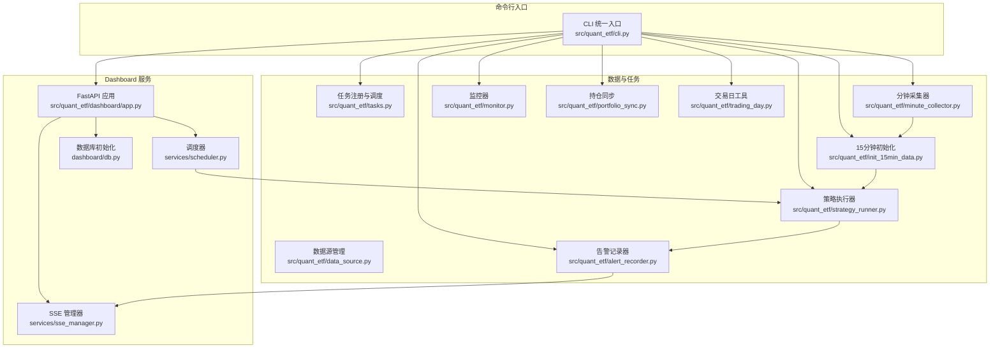
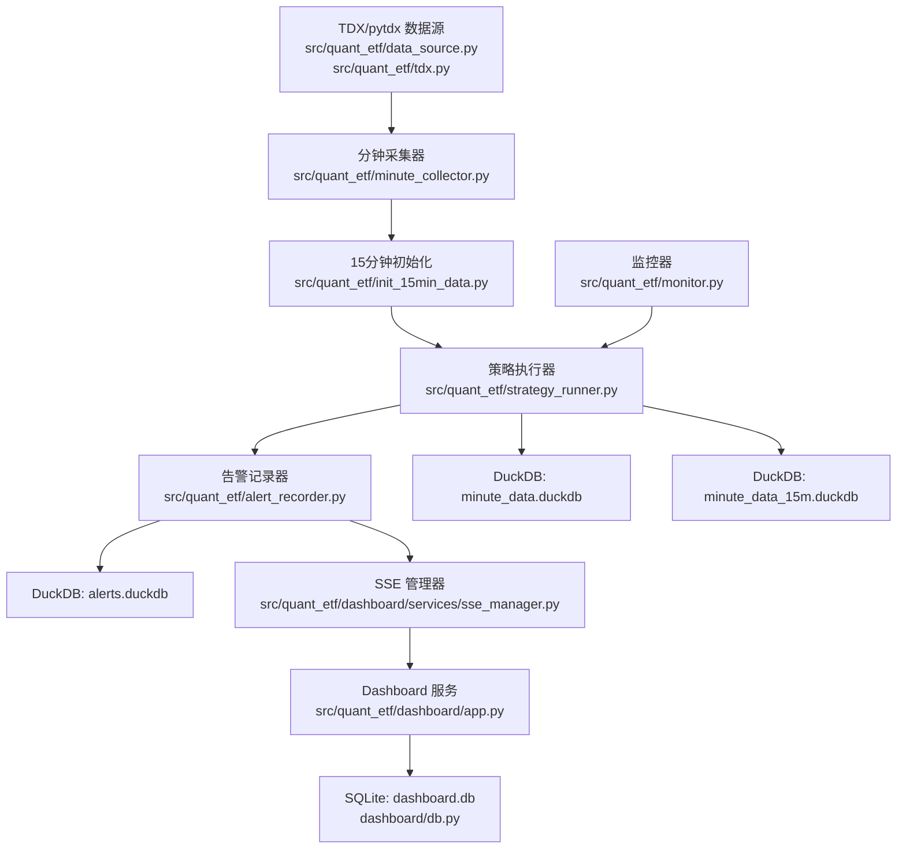
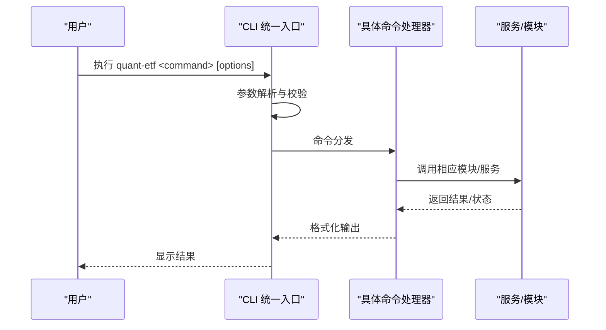
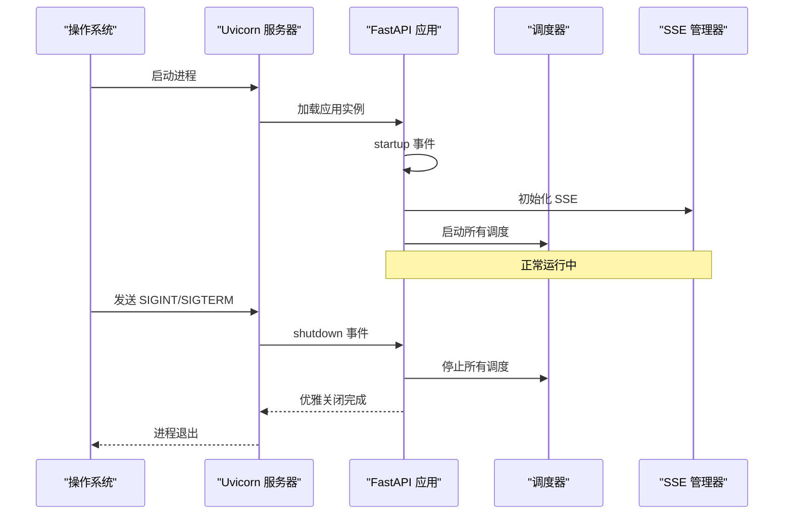
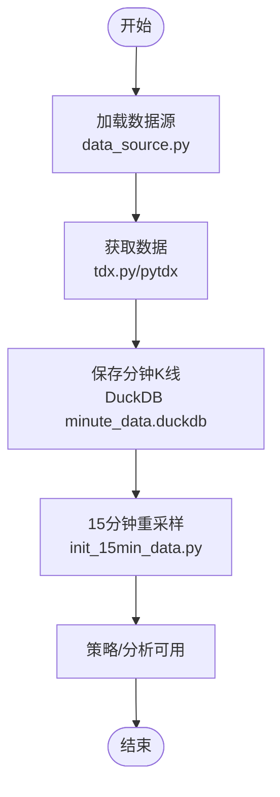
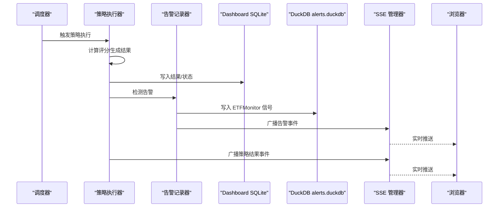
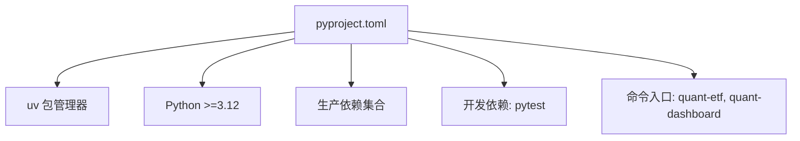

# 系统维护

<cite>
**本文引用的文件**
- [README.md](file://README.md)
- [DEVELOPMENT.md](file://DEVELOPMENT.md)
- [pyproject.toml](file://pyproject.toml)
- [src/quant_etf/cli.py](file://src/quant_etf/cli.py)
- [src/quant_etf/dashboard/app.py](file://src/quant_etf/dashboard/app.py)
- [src/quant_etf/dashboard/db.py](file://src/quant_etf/dashboard/db.py)
- [src/quant_etf/dashboard/services/scheduler.py](file://src/quant_etf/dashboard/services/scheduler.py)
- [src/quant_etf/dashboard/services/sse_manager.py](file://src/quant_etf/dashboard/services/sse_manager.py)
- [src/quant_etf/tasks.py](file://src/quant_etf/tasks.py)
- [src/quant_etf/data_source.py](file://src/quant_etf/data_source.py)
- [src/quant_etf/tdx.py](file://src/quant_etf/tdx.py)
- [src/quant_etf/minute_collector.py](file://src/quant_etf/minute_collector.py)
- [src/quant_etf/init_15min_data.py](file://src/quant_etf/init_15min_data.py)
- [src/quant_etf/monitor.py](file://src/quant_etf/monitor.py)
- [src/quant_etf/alert_recorder.py](file://src/quant_etf/alert_recorder.py)
- [src/quant_etf/market_analyzer.py](file://src/quant_etf/market_analyzer.py)
- [src/quant_etf/strategy_runner.py](file://src/quant_etf/strategy_runner.py)
- [src/quant_etf/portfolio_sync.py](file://src/quant_etf/portfolio_sync.py)
- [src/quant_etf/trading_day.py](file://src/quant_etf/trading_day.py)
- [src/quant_etf/conf.py](file://src/quant_etf/conf.py)
- [run_daily.py](file://run_daily.py)
- [run_dashboard.py](file://run_dashboard.py)
- [restart_dashboard.py](file://restart_dashboard.py)
- [backfill_daily.py](file://backfill_daily.py)
- [_check.py](file://_check.py)
- [scripts/validate_etf_data.py](file://scripts/validate_etf_data.py)
</cite>

## 目录
1. [简介](#简介)
2. [项目结构](#项目结构)
3. [核心组件](#核心组件)
4. [架构总览](#架构总览)
5. [详细组件分析](#详细组件分析)
6. [依赖分析](#依赖分析)
7. [性能考虑](#性能考虑)
8. [故障排查指南](#故障排查指南)
9. [结论](#结论)
10. [附录](#附录)

## 简介
本指南面向运维与开发团队，提供 Quant-ETF 项目的系统维护手册，涵盖日常维护任务、数据备份与清理、系统重启与更新、数据库维护、依赖与版本管理、配置变更与热重载、数据迁移与升级、健康检查与预防性维护、用户权限与安全审计，以及灾难恢复与业务连续性计划。内容以项目现有实现为依据，结合 CLI 命令与服务架构，确保可操作、可落地。

## 项目结构
项目采用“统一 CLI + 模块化子系统”的组织方式：
- CLI 统一入口负责参数解析与命令分发，覆盖每日任务、看板、分钟采集、回填、重启、健康检查等。
- Dashboard 基于 FastAPI + Uvicorn，提供 SSE 实时推送与多页面路由。
- 数据层包含 SQLite 与 DuckDB，分别承载看板元数据与分钟级/结果/告警数据。
- 任务调度、告警引擎、策略执行、数据采集与导出等功能模块相对独立，通过服务层协调。

**图示来源**
- [src/quant_etf/cli.py](file://src/quant_etf/cli.py)
- [src/quant_etf/dashboard/app.py](file://src/quant_etf/dashboard/app.py)
- [src/quant_etf/dashboard/services/scheduler.py](file://src/quant_etf/dashboard/services/scheduler.py)
- [src/quant_etf/dashboard/services/sse_manager.py](file://src/quant_etf/dashboard/services/sse_manager.py)
- [src/quant_etf/dashboard/db.py](file://src/quant_etf/dashboard/db.py)
- [src/quant_etf/tasks.py](file://src/quant_etf/tasks.py)
- [src/quant_etf/data_source.py](file://src/quant_etf/data_source.py)
- [src/quant_etf/minute_collector.py](file://src/quant_etf/minute_collector.py)
- [src/quant_etf/init_15min_data.py](file://src/quant_etf/init_15min_data.py)
- [src/quant_etf/monitor.py](file://src/quant_etf/monitor.py)
- [src/quant_etf/alert_recorder.py](file://src/quant_etf/alert_recorder.py)
- [src/quant_etf/strategy_runner.py](file://src/quant_etf/strategy_runner.py)
- [src/quant_etf/portfolio_sync.py](file://src/quant_etf/portfolio_sync.py)
- [src/quant_etf/trading_day.py](file://src/quant_etf/trading_day.py)

**章节来源**
- [README.md: 199-215:199-215](file://README.md#L199-L215)
- [README.md: 355-381:355-381](file://README.md#L355-L381)
- [pyproject.toml: 28-31:28-31](file://pyproject.toml#L28-L31)

## 核心组件
- CLI 统一入口：集中管理命令分发，兼容旧版脚本重定向。
- Dashboard 应用：FastAPI + Uvicorn，SSE 实时推送，优雅停机。
- 任务系统：任务注册、调度、执行与结果输出。
- 数据系统：SQLite/DuckDB 存储，分钟级数据采集与重采样。
- 监控与告警：Dashboard 告警引擎与 ETFMonitor 信号告警。
- 配置与环境：配置文件与环境变量驱动行为。

**章节来源**
- [src/quant_etf/cli.py](file://src/quant_etf/cli.py)
- [src/quant_etf/dashboard/app.py](file://src/quant_etf/dashboard/app.py)
- [src/quant_etf/tasks.py](file://src/quant_etf/tasks.py)
- [src/quant_etf/data_source.py](file://src/quant_etf/data_source.py)
- [src/quant_etf/minute_collector.py](file://src/quant_etf/minute_collector.py)
- [src/quant_etf/init_15min_data.py](file://src/quant_etf/init_15min_data.py)
- [src/quant_etf/monitor.py](file://src/quant_etf/monitor.py)
- [src/quant_etf/alert_recorder.py](file://src/quant_etf/alert_recorder.py)
- [src/quant_etf/strategy_runner.py](file://src/quant_etf/strategy_runner.py)
- [src/quant_etf/portfolio_sync.py](file://src/quant_etf/portfolio_sync.py)
- [src/quant_etf/trading_day.py](file://src/quant_etf/trading_day.py)
- [src/quant_etf/conf.py](file://src/quant_etf/conf.py)

## 架构总览
系统采用“CLI 统一入口 + FastAPI 服务 + 多数据源 + 任务调度”的架构。数据流从 TDX/pytdx 获取，经分钟采集与重采样，进入策略执行与告警记录，最终通过 SSE 推送到 Dashboard。

**图示来源**
- [src/quant_etf/data_source.py](file://src/quant_etf/data_source.py)
- [src/quant_etf/tdx.py](file://src/quant_etf/tdx.py)
- [src/quant_etf/minute_collector.py](file://src/quant_etf/minute_collector.py)
- [src/quant_etf/init_15min_data.py](file://src/quant_etf/init_15min_data.py)
- [src/quant_etf/monitor.py](file://src/quant_etf/monitor.py)
- [src/quant_etf/strategy_runner.py](file://src/quant_etf/strategy_runner.py)
- [src/quant_etf/alert_recorder.py](file://src/quant_etf/alert_recorder.py)
- [src/quant_etf/dashboard/db.py](file://src/quant_etf/dashboard/db.py)
- [src/quant_etf/dashboard/app.py](file://src/quant_etf/dashboard/app.py)
- [src/quant_etf/dashboard/services/sse_manager.py](file://src/quant_etf/dashboard/services/sse_manager.py)

## 详细组件分析

### CLI 统一入口与命令维护
- daily-run：批量运行 ETF/短线/中期反弹策略，支持天数或指定日期。
- run：运行单个策略任务。
- list-tasks：列出可用策略任务。
- dashboard：启动 Dashboard（支持主机、端口、禁用热重载）。
- minute-collect：启动分钟级数据采集，支持 Ctrl+C 优雅退出。
- backfill：批量补跑历史日期任务。
- restart-dashboard：一键重启 Dashboard（查找并终止旧进程，再在同一端口启动）。
- check：对 Dashboard 各页面进行健康检查。
- backfill-stock-names：补齐缺失的股票代码名称。

**图示来源**
- [src/quant_etf/cli.py](file://src/quant_etf/cli.py)
- [README.md: 70-196:70-196](file://README.md#L70-L196)

**章节来源**
- [README.md: 70-196:70-196](file://README.md#L70-L196)
- [run_daily.py: 1-20:1-20](file://run_daily.py#L1-L20)
- [run_dashboard.py: 1-20:1-20](file://run_dashboard.py#L1-L20)
- [restart_dashboard.py: 1-20:1-20](file://restart_dashboard.py#L1-L20)

### Dashboard 服务与优雅停机
- 启动：FastAPI 应用，挂载路由，初始化数据库与调度器。
- 关闭：优雅停机，停止所有调度任务，等待最多 3 秒后强制退出。
- SSE：/events 端点，心跳保活，客户端断开自动清理队列。
- 热重载：可通过环境变量控制，默认开启；生产建议关闭。

**图示来源**
- [src/quant_etf/dashboard/app.py](file://src/quant_etf/dashboard/app.py)
- [src/quant_etf/dashboard/services/sse_manager.py](file://src/quant_etf/dashboard/services/sse_manager.py)
- [src/quant_etf/dashboard/services/scheduler.py](file://src/quant_etf/dashboard/services/scheduler.py)

**章节来源**
- [src/quant_etf/dashboard/app.py](file://src/quant_etf/dashboard/app.py)
- [src/quant_etf/dashboard/services/sse_manager.py](file://src/quant_etf/dashboard/services/sse_manager.py)
- [src/quant_etf/dashboard/services/scheduler.py](file://src/quant_etf/dashboard/services/scheduler.py)

### 数据采集与存储
- 数据源：本地 TDX 文件、缓存、在线 pytdx 三层策略。
- 分钟采集：持续运行，交易时段每分钟采集 ALL_POOL 标的 1 分钟 K 线。
- 15 分钟初始化：对分钟数据进行重采样，供策略与分析使用。
- 存储：SQLite dashboard.db（账户/调度/告警规则等），DuckDB minute_data.duckdb、minute_data_15m.duckdb、alerts.duckdb。

**图示来源**
- [src/quant_etf/data_source.py](file://src/quant_etf/data_source.py)
- [src/quant_etf/tdx.py](file://src/quant_etf/tdx.py)
- [src/quant_etf/minute_collector.py](file://src/quant_etf/minute_collector.py)
- [src/quant_etf/init_15min_data.py](file://src/quant_etf/init_15min_data.py)

**章节来源**
- [src/quant_etf/data_source.py](file://src/quant_etf/data_source.py)
- [src/quant_etf/tdx.py](file://src/quant_etf/tdx.py)
- [src/quant_etf/minute_collector.py](file://src/quant_etf/minute_collector.py)
- [src/quant_etf/init_15min_data.py](file://src/quant_etf/init_15min_data.py)

### 策略执行与告警
- 策略执行：策略运行器根据调度触发，生成 CSV 结果。
- Dashboard 告警：对比上次结果，检测进入前三、动量突变等规则，写入 SQLite。
- ETFMonitor 告警：分钟级监控循环写入独立 DuckDB，Dashboard 查询展示。
- SSE 推送：策略结果、错误、告警、持仓更新等事件实时推送到浏览器。

**图示来源**
- [src/quant_etf/dashboard/services/scheduler.py](file://src/quant_etf/dashboard/services/scheduler.py)
- [src/quant_etf/strategy_runner.py](file://src/quant_etf/strategy_runner.py)
- [src/quant_etf/alert_recorder.py](file://src/quant_etf/alert_recorder.py)
- [src/quant_etf/dashboard/db.py](file://src/quant_etf/dashboard/db.py)
- [src/quant_etf/dashboard/services/sse_manager.py](file://src/quant_etf/dashboard/services/sse_manager.py)

**章节来源**
- [src/quant_etf/strategy_runner.py](file://src/quant_etf/strategy_runner.py)
- [src/quant_etf/alert_recorder.py](file://src/quant_etf/alert_recorder.py)
- [src/quant_etf/dashboard/db.py](file://src/quant_etf/dashboard/db.py)
- [src/quant_etf/dashboard/services/sse_manager.py](file://src/quant_etf/dashboard/services/sse_manager.py)

## 依赖分析
- 语言与包管理：Python 3.12+，uv 作为包管理器与索引镜像配置。
- 依赖组：生产依赖包含日志、数值计算、HTTP、数据库、Web 框架等；开发依赖包含 pytest。
- CLI 脚本：注册了两个命令入口，分别指向 CLI 与 Dashboard 应用。
- 依赖来源：pytdx 本地 whl 指定，索引优先使用阿里云/清华源。

**图示来源**
- [pyproject.toml: 1-53:1-53](file://pyproject.toml#L1-L53)

**章节来源**
- [pyproject.toml: 1-53:1-53](file://pyproject.toml#L1-L53)

## 性能考虑
- 数据库性能
  - SQLite：适合看板元数据与小规模并发；建议定期执行 VACUUM、ANALYZE，优化查询计划。
  - DuckDB：适合高吞吐写入与复杂查询；建议定期压缩与统计信息更新。
- I/O 与网络
  - 分钟采集与重采样为 IO 密集型，建议合理安排采集时间窗，避免与策略高峰冲突。
  - 在线数据源依赖网络稳定性，建议增加重试与降级策略。
- 服务性能
  - SSE 连接数较多时，注意内存与队列管理；必要时限制并发或启用限流。
  - 生产环境关闭热重载，减少不必要的文件监听与重启。

[本节为通用性能建议，不直接分析具体文件]

## 故障排查指南
- Dashboard 健康检查
  - 使用 CLI 健康检查命令对各页面路由进行验证，定位服务异常。
- 进程管理与重启
  - 使用一键重启命令终止旧进程并在同一端口启动新进程，确保端口占用问题快速解决。
- 日志与异常
  - 应用层捕获未处理异常并返回 500；建议结合日志与健康检查定位问题。
- 数据一致性
  - 若出现 DuckDB 冲突或数据不一致，先停止相关服务，再进行数据校验与修复。

**章节来源**
- [README.md: 176-188:176-188](file://README.md#L176-L188)
- [README.md: 168-175:168-175](file://README.md#L168-L175)
- [src/quant_etf/dashboard/app.py](file://src/quant_etf/dashboard/app.py)
- [tests/test_duckdb_conflict.py](file://tests/test_duckdb_conflict.py)

## 结论
本维护指南基于项目现有实现，提供了从日常维护到灾难恢复的完整操作框架。建议将维护流程固化为标准作业程序（SOP），并结合自动化脚本与监控告警，提升系统的稳定性与可维护性。

## 附录

### 日常维护任务与流程
- 数据备份策略
  - SQLite：定期导出 dashboard.db，保留多个历史版本。
  - DuckDB：对 minute_data.duckdb、minute_data_15m.duckdb、alerts.duckdb 进行快照备份。
  - 策略结果：CSV 输出目录按日期归档。
- 定期清理
  - 日志与临时文件清理，保留最近 N 天。
  - 过期的历史策略结果与中间文件清理。
- 系统重启与更新
  - 优雅停机：使用 Dashboard 的优雅停机机制，等待任务完成或超时。
  - 更新流程：打包新版本，停止服务，替换依赖与代码，启动服务并健康检查。
- 依赖包更新与版本管理
  - 使用 uv 管理依赖，遵循 pyproject.toml 的版本约束。
  - 开发依赖仅在本地使用，生产环境保持稳定。
- 配置文件变更与热重载
  - Dashboard 热重载可通过环境变量控制；生产环境建议关闭。
  - 配置项通过环境变量覆盖，如 DASHBOARD_HOST、DASHBOARD_PORT。
- 数据迁移与版本升级
  - 数据库结构变更需编写迁移脚本，先在测试环境验证。
  - 升级前备份数据库，升级后执行 VACUUM/ANALYZE。
- 系统健康检查清单
  - CLI 健康检查：检查各页面路由响应。
  - 服务状态：进程存活、端口监听、SSE 连接数。
  - 数据链路：分钟采集、重采样、策略执行、告警推送。
- 用户权限与安全审计
  - 限制 Dashboard 访问范围，生产环境绑定内网或使用反向代理。
  - 审计日志：记录关键操作（策略执行、配置变更、用户登录）。
- 灾难恢复演练与业务连续性
  - 定期演练：模拟数据库损坏、服务崩溃、网络中断场景。
  - RTO/RPO：明确恢复时间与数据丢失容忍度，准备备用节点与异地备份。

**章节来源**
- [README.md: 355-381:355-381](file://README.md#L355-L381)
- [README.md: 566-586:566-586](file://README.md#L566-L586)
- [src/quant_etf/dashboard/app.py](file://src/quant_etf/dashboard/app.py)
- [src/quant_etf/dashboard/db.py](file://src/quant_etf/dashboard/db.py)
- [src/quant_etf/conf.py](file://src/quant_etf/conf.py)
- [pyproject.toml: 32-42:32-42](file://pyproject.toml#L32-L42)