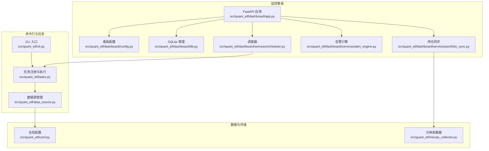
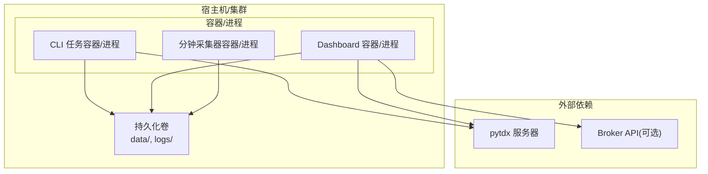
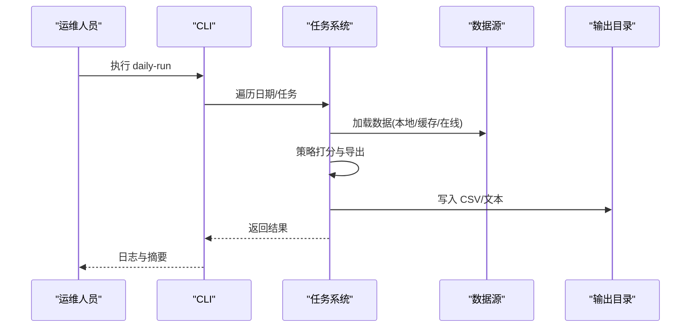
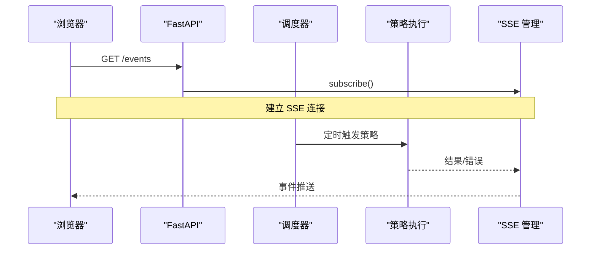
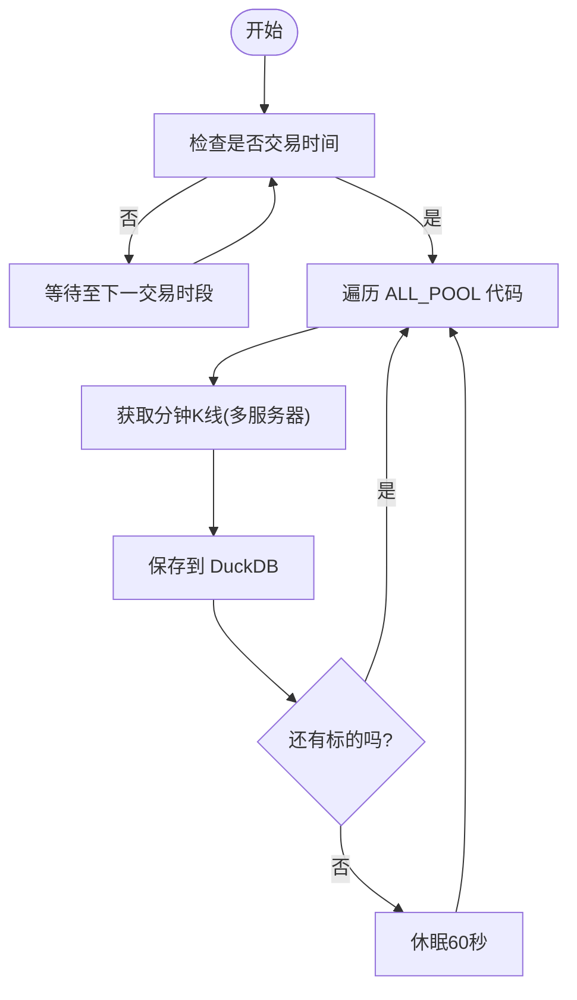
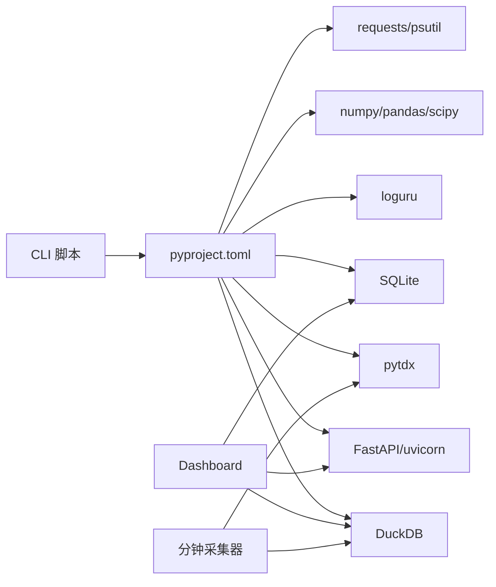

# 部署和运维

<cite>
**本文引用的文件**
- [README.md](file://README.md)
- [DEVELOPMENT.md](file://DEVELOPMENT.md)
- [pyproject.toml](file://pyproject.toml)
- [src/quant_etf/cli.py](file://src/quant_etf/cli.py)
- [src/quant_etf/tasks.py](file://src/quant_etf/tasks.py)
- [src/quant_etf/data_source.py](file://src/quant_etf/data_source.py)
- [src/quant_etf/minute_collector.py](file://src/quant_etf/minute_collector.py)
- [src/quant_etf/conf.py](file://src/quant_etf/conf.py)
- [src/quant_etf/dashboard/app.py](file://src/quant_etf/dashboard/app.py)
- [src/quant_etf/dashboard/config.py](file://src/quant_etf/dashboard/config.py)
- [src/quant_etf/dashboard/db.py](file://src/quant_etf/dashboard/db.py)
- [src/quant_etf/dashboard/services/scheduler.py](file://src/quant_etf/dashboard/services/scheduler.py)
- [src/quant_etf/dashboard/services/alert_engine.py](file://src/quant_etf/dashboard/services/alert_engine.py)
- [src/quant_etf/dashboard/services/portfolio_sync.py](file://src/quant_etf/dashboard/services/portfolio_sync.py)
</cite>

## 目录
1. [简介](#简介)
2. [项目结构](#项目结构)
3. [核心组件](#核心组件)
4. [架构总览](#架构总览)
5. [详细组件分析](#详细组件分析)
6. [依赖分析](#依赖分析)
7. [性能考虑](#性能考虑)
8. [故障排除指南](#故障排除指南)
9. [结论](#结论)
10. [附录](#附录)

## 简介
本文件面向运维团队，提供 Quant-ETF 项目的完整部署与运维指南。内容涵盖生产环境部署架构、容器化与 Docker 配置建议、性能优化策略、监控与告警最佳实践、日常维护流程、故障排除手册、备份与灾难恢复策略，以及日志管理与分析方法。文档严格基于仓库现有代码与配置，确保可操作性与准确性。

## 项目结构
项目采用模块化设计，核心分为 CLI 统一路由、数据采集与任务执行、Dashboard 监控系统三大块。数据源支持本地 TDX 文件、缓存与在线获取三层策略；Dashboard 基于 FastAPI + Uvicorn，使用 SQLite/DuckDB 存储，SSE 实时推送；分钟级数据采集器通过 DuckDB 存储，支持多服务器自动切换与冷却。

**图示来源**
- [src/quant_etf/cli.py:1-403](file://src/quant_etf/cli.py#L1-L403)
- [src/quant_etf/tasks.py:1-450](file://src/quant_etf/tasks.py#L1-L450)
- [src/quant_etf/data_source.py:1-381](file://src/quant_etf/data_source.py#L1-L381)
- [src/quant_etf/conf.py:1-137](file://src/quant_etf/conf.py#L1-L137)
- [src/quant_etf/dashboard/app.py:1-87](file://src/quant_etf/dashboard/app.py#L1-L87)
- [src/quant_etf/dashboard/config.py:1-25](file://src/quant_etf/dashboard/config.py#L1-L25)
- [src/quant_etf/dashboard/db.py:1-133](file://src/quant_etf/dashboard/db.py#L1-L133)
- [src/quant_etf/dashboard/services/scheduler.py:1-82](file://src/quant_etf/dashboard/services/scheduler.py#L1-L82)
- [src/quant_etf/dashboard/services/alert_engine.py:1-120](file://src/quant_etf/dashboard/services/alert_engine.py#L1-L120)
- [src/quant_etf/dashboard/services/portfolio_sync.py:1-87](file://src/quant_etf/dashboard/services/portfolio_sync.py#L1-L87)
- [src/quant_etf/minute_collector.py:1-505](file://src/quant_etf/minute_collector.py#L1-L505)

**章节来源**
- [README.md:253-276](file://README.md#L253-L276)
- [src/quant_etf/cli.py:1-403](file://src/quant_etf/cli.py#L1-L403)
- [src/quant_etf/tasks.py:1-450](file://src/quant_etf/tasks.py#L1-L450)
- [src/quant_etf/data_source.py:1-381](file://src/quant_etf/data_source.py#L1-L381)
- [src/quant_etf/dashboard/app.py:1-87](file://src/quant_etf/dashboard/app.py#L1-L87)
- [src/quant_etf/dashboard/config.py:1-25](file://src/quant_etf/dashboard/config.py#L1-L25)
- [src/quant_etf/dashboard/db.py:1-133](file://src/quant_etf/dashboard/db.py#L1-L133)
- [src/quant_etf/dashboard/services/scheduler.py:1-82](file://src/quant_etf/dashboard/services/scheduler.py#L1-L82)
- [src/quant_etf/dashboard/services/alert_engine.py:1-120](file://src/quant_etf/dashboard/services/alert_engine.py#L1-L120)
- [src/quant_etf/dashboard/services/portfolio_sync.py:1-87](file://src/quant_etf/dashboard/services/portfolio_sync.py#L1-L87)
- [src/quant_etf/minute_collector.py:1-505](file://src/quant_etf/minute_collector.py#L1-L505)
- [src/quant_etf/conf.py:1-137](file://src/quant_etf/conf.py#L1-L137)

## 核心组件
- CLI 统一路由：提供 daily-run、dashboard、minute-collect、backfill、restart-dashboard、run、list-tasks、check、backfill-stock-names 等命令，集中管理各子系统。
- 任务系统：ETFTask、ShortTermStockTask、MidTermReboundTask 三类任务，统一调度与结果导出。
- 数据源：本地 TDX 文件 → 缓存 → 在线获取三层策略，支持名称映射与新鲜度检查。
- Dashboard：FastAPI + Uvicorn，SQLite/DuckDB 存储，SSE 实时推送，提供策略、持仓、监控、告警、设置等页面。
- 分钟采集器：DuckDB 存储，pytdx 多服务器自动切换与冷却，交易时间判断与等待。
- 配置中心：全局配置与看板配置，支持环境变量覆盖。

**章节来源**
- [README.md:70-196](file://README.md#L70-L196)
- [src/quant_etf/cli.py:324-382](file://src/quant_etf/cli.py#L324-L382)
- [src/quant_etf/tasks.py:30-160](file://src/quant_etf/tasks.py#L30-L160)
- [src/quant_etf/data_source.py:15-381](file://src/quant_etf/data_source.py#L15-L381)
- [src/quant_etf/dashboard/app.py:17-86](file://src/quant_etf/dashboard/app.py#L17-L86)
- [src/quant_etf/minute_collector.py:41-102](file://src/quant_etf/minute_collector.py#L41-L102)
- [src/quant_etf/conf.py:1-137](file://src/quant_etf/conf.py#L1-L137)

## 架构总览
生产环境建议采用“单机多进程”或“容器化编排”两种部署形态：
- 单机多进程：使用 systemd/cron 管理 CLI 任务与 Dashboard；分钟采集器作为独立守护进程运行。
- 容器化：分别打包 CLI 任务、Dashboard、分钟采集器为独立镜像，通过 Docker Compose 或 Kubernetes 管理；DuckDB/SQLite 数据持久化挂载卷。

[此图为概念性架构示意，不直接映射具体源码文件，故不附“图示来源”]

## 详细组件分析

### CLI 与任务系统
- daily-run：批量运行 etf/short/mid 任务，生成汇总报告并落盘。
- run：运行单个任务，支持日期指定。
- backfill：按交易日批量补跑历史任务。
- list-tasks：列出可用任务。
- check：健康检查各页面路由。
- restart-dashboard：查找并终止旧进程，再启动新进程。
- backfill-stock-names：补齐 stock_code_name.json 中缺失的股票名称。

**图示来源**
- [src/quant_etf/cli.py:24-71](file://src/quant_etf/cli.py#L24-L71)
- [src/quant_etf/tasks.py:114-160](file://src/quant_etf/tasks.py#L114-L160)
- [src/quant_etf/data_source.py:189-236](file://src/quant_etf/data_source.py#L189-L236)

**章节来源**
- [README.md:95-196](file://README.md#L95-L196)
- [src/quant_etf/cli.py:24-382](file://src/quant_etf/cli.py#L24-L382)
- [src/quant_etf/tasks.py:162-450](file://src/quant_etf/tasks.py#L162-L450)
- [src/quant_etf/data_source.py:189-381](file://src/quant_etf/data_source.py#L189-L381)

### Dashboard 监控系统
- 启动与关闭：Uvicorn 运行 FastAPI，启动时初始化数据库与调度器，关闭时停止调度器。
- 路由与页面：/pages/* 与 /api/*，支持 HTMX 片段加载与全页加载。
- SSE 实时推送：/events，广播策略结果、错误、告警、持仓更新等事件。
- 数据存储：SQLite(dashboard.db)、DuckDB(results.duckdb、alerts.duckdb、minute_data.duckdb)。
- 配置：DASHBOARD_HOST/DASHBOARD_PORT/SSE_HEARTBEAT_INTERVAL/ALERT_MOMENTUM_SHOCK_THRESHOLD。

**图示来源**
- [src/quant_etf/dashboard/app.py:39-50](file://src/quant_etf/dashboard/app.py#L39-L50)
- [src/quant_etf/dashboard/services/scheduler.py:19-52](file://src/quant_etf/dashboard/services/scheduler.py#L19-L52)

**章节来源**
- [README.md:319-590](file://README.md#L319-L590)
- [src/quant_etf/dashboard/app.py:17-86](file://src/quant_etf/dashboard/app.py#L17-L86)
- [src/quant_etf/dashboard/config.py:16-25](file://src/quant_etf/dashboard/config.py#L16-L25)
- [src/quant_etf/dashboard/db.py:69-133](file://src/quant_etf/dashboard/db.py#L69-L133)
- [src/quant_etf/dashboard/services/scheduler.py:15-82](file://src/quant_etf/dashboard/services/scheduler.py#L15-L82)
- [src/quant_etf/dashboard/services/alert_engine.py:20-120](file://src/quant_etf/dashboard/services/alert_engine.py#L20-L120)
- [src/quant_etf/dashboard/services/portfolio_sync.py:15-87](file://src/quant_etf/dashboard/services/portfolio_sync.py#L15-L87)

### 分钟级数据采集器
- 服务器选择：支持自定义服务器列表与官方服务器，失败冷却与自动切换。
- 交易时间：判断与等待，仅在交易时段采集。
- 存储：DuckDB minute_bars 表，带索引 code/time，支持查询与重采样。
- 批量采集：对 ALL_POOL 标的逐个采集并入库。

**图示来源**
- [src/quant_etf/minute_collector.py:158-232](file://src/quant_etf/minute_collector.py#L158-L232)
- [src/quant_etf/minute_collector.py:458-488](file://src/quant_etf/minute_collector.py#L458-L488)
- [src/quant_etf/minute_collector.py:245-277](file://src/quant_etf/minute_collector.py#L245-L277)

**章节来源**
- [src/quant_etf/minute_collector.py:1-505](file://src/quant_etf/minute_collector.py#L1-L505)
- [src/quant_etf/conf.py:97-98](file://src/quant_etf/conf.py#L97-L98)

### 数据源与名称映射
- 三层加载：本地 TDX 文件 → 缓存 → 在线获取。
- 名称映射：从 data/meta/stock_code_name.json 加载 ETF/股票名称映射，支持补齐缺失项。
- 新鲜度检查：根据交易日与时段判断数据是否新鲜。

**章节来源**
- [src/quant_etf/data_source.py:15-381](file://src/quant_etf/data_source.py#L15-L381)
- [src/quant_etf/conf.py:1-137](file://src/quant_etf/conf.py#L1-L137)

## 依赖分析
- 语言与包管理：Python 3.12+，uv 管理依赖与虚拟环境。
- 运行时依赖：FastAPI、Uvicorn、DuckDB、SQLite、pytdx、loguru、pandas/numpy/scipy、requests、psutil。
- 项目脚本：CLI 通过 pyproject.toml 注册，支持 quant-etf 与 quant-dashboard 两个入口。

**图示来源**
- [pyproject.toml:1-53](file://pyproject.toml#L1-L53)
- [src/quant_etf/cli.py:28-30](file://src/quant_etf/cli.py#L28-L30)
- [src/quant_etf/dashboard/app.py:17-24](file://src/quant_etf/dashboard/app.py#L17-L24)

**章节来源**
- [pyproject.toml:1-53](file://pyproject.toml#L1-L53)
- [src/quant_etf/cli.py:28-30](file://src/quant_etf/cli.py#L28-L30)
- [src/quant_etf/dashboard/app.py:17-24](file://src/quant_etf/dashboard/app.py#L17-L24)

## 性能考虑
- 数据加载与缓存
  - 优先本地 TDX 文件，其次缓存，最后在线获取，减少重复网络请求。
  - 使用 check_is_fresh 判定数据新鲜度，避免无效重跑。
- DuckDB 存储
  - minute_bars 建有 code/time 复合主键与索引，查询时尽量带上时间范围与 code。
  - 批量插入使用 executemany 或 SELECT 插入，减少往返开销。
- 策略执行
  - 使用 pandas 进行向量化计算，避免逐行循环；合理设置 TOP_N 与池大小。
  - 将 CSV 导出与 TDX 导入文件生成分离，避免阻塞主流程。
- SSE 与并发
  - SSE 使用 asyncio.Queue，广播时注意消息体大小与频率，避免阻塞事件循环。
  - 调度器使用 asyncio.create_task，确保异常不影响其他任务。
- 网络与服务器
  - minute_collector 支持多服务器自动切换与冷却，降低单点故障影响。
- 日志与监控
  - 使用 loguru 按天切割日志，避免单文件过大；生产环境建议集中收集与归档。

[本节为通用性能建议，不直接分析具体文件，故不附“章节来源”]

## 故障排除指南
- Dashboard 无法启动或端口占用
  - 使用 restart-dashboard 一键重启，内部会查找并终止旧进程，再启动新服务。
  - 检查 DASHBOARD_HOST/DASHBOARD_PORT 环境变量与 CLI --host/--port 参数。
- 健康检查失败
  - 使用 check 命令遍历各页面路由，定位具体页面错误。
- 数据加载失败
  - 确认 TDX 数据目录路径与权限，Linux 默认路径为用户目录下的 share/tdx。
  - 若本地无数据，确认在线获取依赖 pytdx 正常安装与网络连通。
- 分钟采集异常
  - 检查交易时间判断与等待逻辑，确认服务器列表与冷却策略生效。
  - DuckDB 表结构与索引是否存在，查询是否带上时间范围。
- 告警未触发
  - 检查 alert_engine 规则与阈值，确认上一次结果与当前结果数据结构一致。
- 持仓价格不同步
  - 确认 minute DuckDB 是否存在，查询最新收盘价是否为空。

**章节来源**
- [README.md:168-188](file://README.md#L168-L188)
- [README.md:176-184](file://README.md#L176-L184)
- [src/quant_etf/cli.py:189-255](file://src/quant_etf/cli.py#L189-L255)
- [src/quant_etf/cli.py:309-322](file://src/quant_etf/cli.py#L309-L322)
- [src/quant_etf/data_source.py:189-236](file://src/quant_etf/data_source.py#L189-L236)
- [src/quant_etf/minute_collector.py:158-232](file://src/quant_etf/minute_collector.py#L158-L232)
- [src/quant_etf/dashboard/services/alert_engine.py:82-96](file://src/quant_etf/dashboard/services/alert_engine.py#L82-L96)
- [src/quant_etf/dashboard/services/portfolio_sync.py:15-66](file://src/quant_etf/dashboard/services/portfolio_sync.py#L15-L66)

## 结论
本指南基于仓库现有代码与配置，提供了从部署到运维的全流程建议。生产环境推荐容器化部署与持久化卷管理，配合完善的日志与监控体系，确保系统稳定、可观测与可恢复。

[本节为总结性内容，不直接分析具体文件，故不附“章节来源”]

## 附录

### 生产环境部署与配置管理
- 环境变量
  - TDX_DATA_PATH：通达信数据目录（Linux 默认 ~/.local/share/tdx；Windows 默认项目内硬编码路径，建议通过环境变量覆盖）。
  - DASHBOARD_HOST/DASHBOARD_PORT：Dashboard 监听地址与端口。
  - DASHBOARD_RELOAD：控制热重载开关（CLI --no-reload 会设置该环境变量）。
- 目录结构
  - data/：SQLite 与 DuckDB 数据文件、分钟数据、结果与告警数据。
  - logs/：按天切割的日志文件。
  - output/：导出的 TDX 导入文件与自定义公式文件。
- 依赖安装
  - 使用 uv 同步依赖，确保 Python 版本满足要求。

**章节来源**
- [README.md:33-69](file://README.md#L33-L69)
- [README.md:355-381](file://README.md#L355-L381)
- [pyproject.toml:6-22](file://pyproject.toml#L6-L22)
- [src/quant_etf/conf.py:104-110](file://src/quant_etf/conf.py#L104-L110)
- [src/quant_etf/dashboard/config.py:17-18](file://src/quant_etf/dashboard/config.py#L17-L18)
- [src/quant_etf/cli.py:80-83](file://src/quant_etf/cli.py#L80-L83)

### 容器化与 Docker 配置建议
- 镜像构建
  - 基础镜像：python:3.12-slim 或 alpine（按需选择）。
  - 依赖安装：使用 uv 安装 pyproject.toml 中的依赖，或使用 pip 安装。
  - 工作目录：/app，复制项目代码，设置 PYTHONPATH。
- 挂载卷
  - /app/data：持久化 SQLite/DuckDB 数据。
  - /app/logs：持久化日志。
  - /app/output：导出文件目录。
- 端口
  - Dashboard：8522/TCP（可通过环境变量覆盖）。
- 进程管理
  - CLI 任务：通过 cron 或 systemd 定时执行。
  - Dashboard：uvicorn 运行。
  - 分钟采集器：独立进程或容器，注意交易时间逻辑。

[本节为容器化建议，不直接分析具体文件，故不附“章节来源”]

### 监控与告警最佳实践
- 指标采集
  - Dashboard：账户数、今日告警、运行中调度数、策略结果统计。
  - 市场状态：指数与池内标的 60 分钟收益、波动率、趋势强度、均线排列。
  - 策略执行：r60/r20/r10/r5、总分、目标权重。
- 告警规则
  - Dashboard 告警引擎：评分进入前三、动量得分突变（阈值可配置）、持仓偏离目标（预留）。
  - SSE 实时推送：connected、strategy_result、strategy_error、alert、portfolio_update。
- 告警联动
  - 通过 SSE 推送到前端，结合 Broker API（如需）实现自动化风控。

**章节来源**
- [README.md:495-565](file://README.md#L495-L565)
- [src/quant_etf/dashboard/services/alert_engine.py:20-96](file://src/quant_etf/dashboard/services/alert_engine.py#L20-L96)
- [src/quant_etf/dashboard/app.py:39-50](file://src/quant_etf/dashboard/app.py#L39-L50)

### 日常维护流程
- 每日任务
  - 使用 daily-run 运行 etf/short/mid 任务，生成汇总报告。
  - 使用 backfill 补跑历史日期任务。
- Dashboard 维护
  - 使用 check 周期性健康检查。
  - 使用 restart-dashboard 一键重启。
- 数据维护
  - 使用 backfill-stock-names 补齐名称映射。
  - 定期清理 logs 与 output，归档历史数据。

**章节来源**
- [README.md:95-196](file://README.md#L95-L196)
- [src/quant_etf/cli.py:24-187](file://src/quant_etf/cli.py#L24-L187)

### 备份与灾难恢复
- 数据备份
  - SQLite：dashboard.db 定期备份。
  - DuckDB：results.duckdb、alerts.duckdb、minute_data.duckdb 定期备份。
  - 日志：logs 目录定期归档。
- 恢复流程
  - 停止相关进程 → 恢复 data/ 与 logs/ → 启动 Dashboard 与采集器 → 健康检查。

**章节来源**
- [README.md:566-586](file://README.md#L566-L586)
- [src/quant_etf/dashboard/db.py:79-91](file://src/quant_etf/dashboard/db.py#L79-L91)

### 日志管理与分析
- 日志级别与轮转
  - CLI 与任务：按天轮转，保留 30 天。
  - Dashboard：按天轮转，建议集中收集（如使用 ELK/Fluentd）。
- 关键日志字段
  - 时间戳、级别、模块名、函数名、行号、消息。
- 分析建议
  - 异常堆栈、错误次数、慢查询、SSE 广播失败、分钟采集失败。

**章节来源**
- [src/quant_etf/cli.py:30-70](file://src/quant_etf/cli.py#L30-L70)
- [src/quant_etf/cli.py:107-142](file://src/quant_etf/cli.py#L107-L142)
- [src/quant_etf/dashboard/app.py:68-72](file://src/quant_etf/dashboard/app.py#L68-L72)