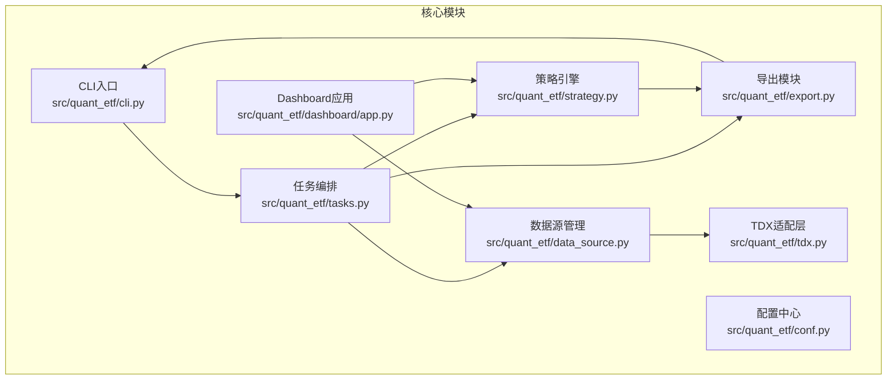
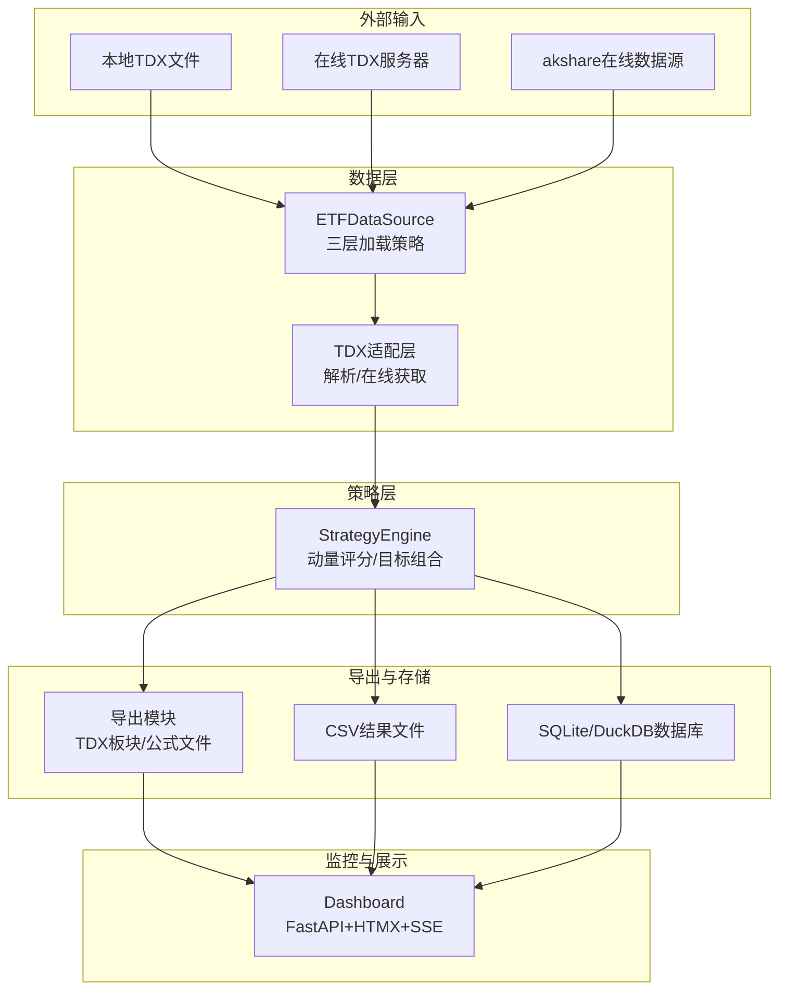
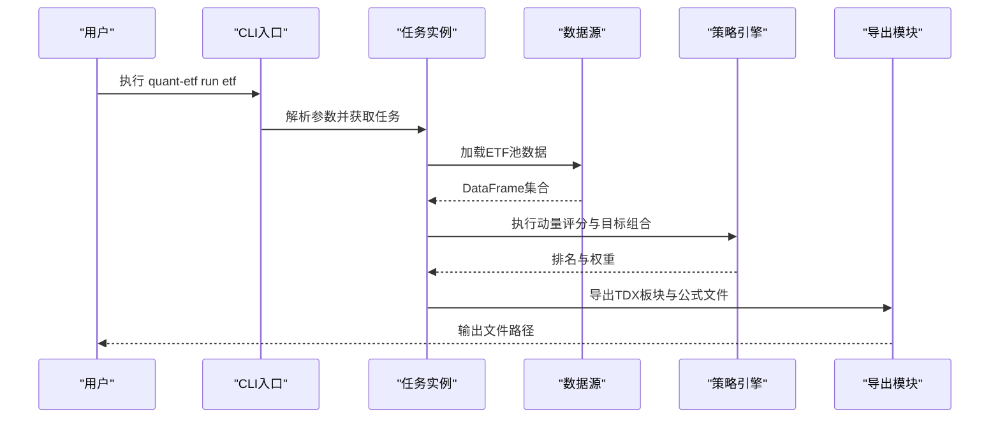
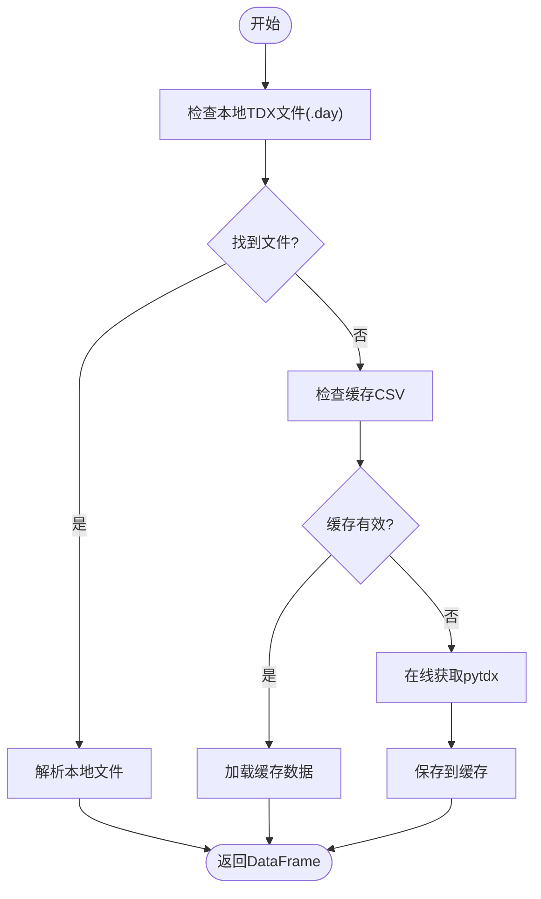
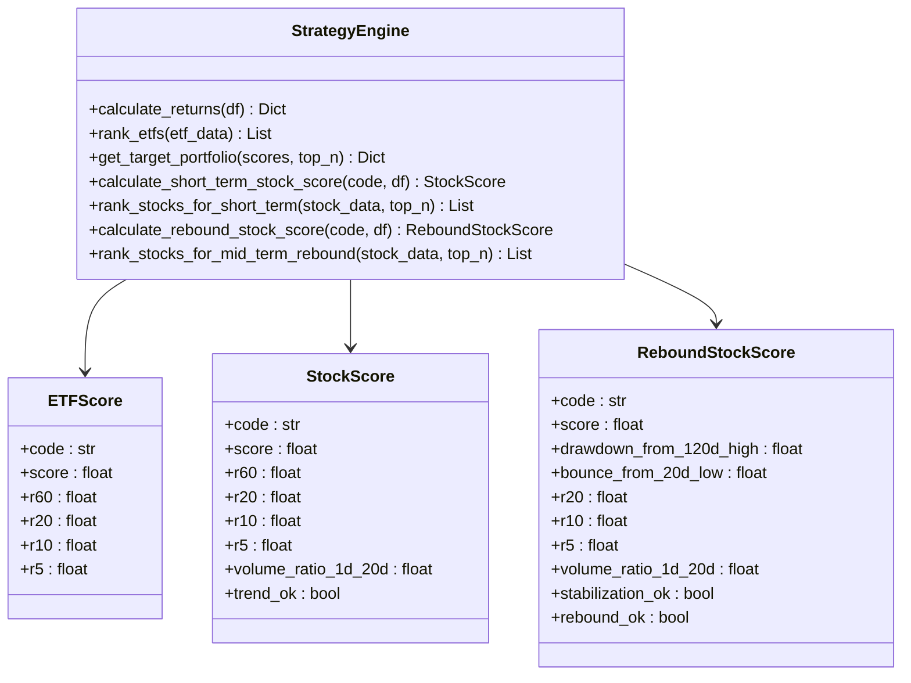
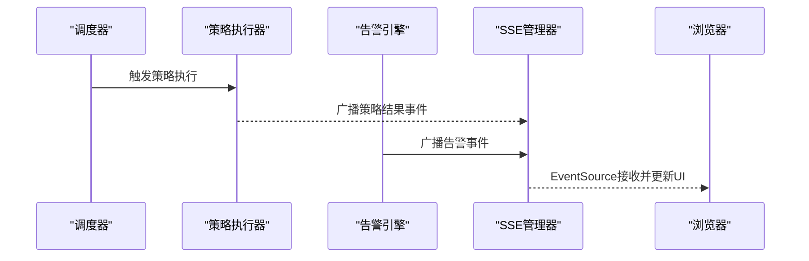
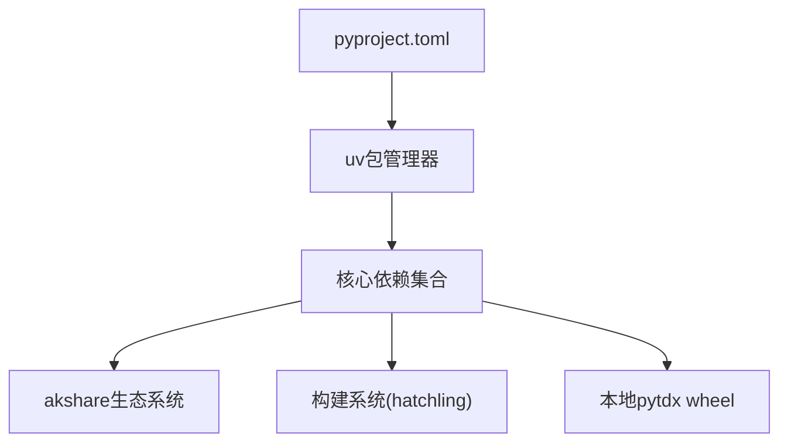

# 项目概述

<cite>
**本文档引用的文件**
- [README.md](file://README.md)
- [DEVELOPMENT.md](file://DEVELOPMENT.md)
- [pyproject.toml](file://pyproject.toml)
- [src/quant_etf/__init__.py](file://src/quant_etf/__init__.py)
- [src/quant_etf/cli.py](file://src/quant_etf/cli.py)
- [src/quant_etf/tasks.py](file://src/quant_etf/tasks.py)
- [src/quant_etf/data_source.py](file://src/quant_etf/data_source.py)
- [src/quant_etf/tdx.py](file://src/quant_etf/tdx.py)
- [src/quant_etf/strategy.py](file://src/quant_etf/strategy.py)
- [src/quant_etf/conf.py](file://src/quant_etf/conf.py)
- [src/quant_etf/export.py](file://src/quant_etf/export.py)
- [src/quant_etf/dashboard/app.py](file://src/quant_etf/dashboard/app.py)
- [docs/design.md](file://docs/design.md)
- [docs/user_improvements.md](file://docs/user_improvements.md)
- [plan.md](file://plan.md)
- [export_tdx_block.py](file://export_tdx_block.py)
- [uv.lock](file://uv.lock)
</cite>

## 目录
1. [引言](#引言)
2. [项目结构](#项目结构)
3. [核心组件](#核心组件)
4. [架构总览](#架构总览)
5. [详细组件分析](#详细组件分析)
6. [依赖分析](#依赖分析)
7. [性能考虑](#性能考虑)
8. [故障排查指南](#故障排查指南)
9. [结论](#结论)
10. [附录](#附录)

## 引言
Quant-ETF 是一个基于动量策略的ETF选股工具，专注于利用60/20/10/5日收益率的加权动量评分，结合通达信(TDX)数据源，提供ETF组合、短线股票与中期反弹三类选股任务，并支持自动导出至通达信以及Dashboard监控面板。项目强调跨平台支持（Windows/Linux）、可配置的动量权重、灵活的任务调度与导出能力，旨在帮助量化投资者在不同市场环境下进行高效、可追溯的策略执行与监控。

项目背景与价值：
- 量化投资痛点：数据来源分散、策略执行与监控割裂、缺乏跨平台一致性与自动化导出能力。
- 解决方案：统一CLI入口、三层数据加载策略（本地TDX文件/缓存/在线）、标准化动量策略、自动导出至通达信、Dashboard实时监控与SSE推送。

## 项目结构
项目采用模块化分层架构，核心目录与职责如下：
- src/quant_etf：核心业务模块（CLI、任务、数据源、策略、导出、配置、仪表盘）
- docs：设计与开发文档
- tests：单元与集成测试
- data/output/logs：数据缓存、输出文件与日志目录
- scripts：辅助脚本（如数据校验）

**图表来源**
- [src/quant_etf/cli.py:1-403](file://src/quant_etf/cli.py#L1-L403)
- [src/quant_etf/tasks.py:1-450](file://src/quant_etf/tasks.py#L1-L450)
- [src/quant_etf/data_source.py:1-381](file://src/quant_etf/data_source.py#L1-L381)
- [src/quant_etf/strategy.py:1-321](file://src/quant_etf/strategy.py#L1-L321)
- [src/quant_etf/export.py:1-118](file://src/quant_etf/export.py#L1-L118)
- [src/quant_etf/tdx.py:1-375](file://src/quant_etf/tdx.py#L1-L375)
- [src/quant_etf/dashboard/app.py:1-87](file://src/quant_etf/dashboard/app.py#L1-L87)

**章节来源**
- [README.md:253-276](file://README.md#L253-L276)
- [DEVELOPMENT.md:47-74](file://DEVELOPMENT.md#L47-L74)

## 核心组件
- CLI统一入口：提供daily-run、run、list-tasks、dashboard、minute-collect、backfill、restart-dashboard、check、backfill-stock-names等命令，集中调度任务与服务。
- 任务系统：ETFTask、ShortTermStockTask、MidTermReboundTask三类任务，统一继承BaseTask，具备标准化的数据加载、策略执行、结果导出流程。
- 数据源管理：三层加载策略（本地TDX文件→缓存→在线），支持ETF与股票数据，提供名称映射缓存与在线补齐。
- 策略引擎：基于动量因子的加权评分与目标组合生成，支持短线与中期反弹评分逻辑。
- 导出模块：生成通达信可导入板块文件与自定义公式文件，支持自动写入通达信自定义板块目录。
- 配置中心：集中管理ETF/股票池、动量权重、TOP_N、TDX目录等全局配置。
- Dashboard：基于FastAPI+HTMX+SQLite/DuckDB+SSE的监控面板，提供策略执行、持仓、市场概览、告警等页面与API。

**章节来源**
- [src/quant_etf/cli.py:1-403](file://src/quant_etf/cli.py#L1-L403)
- [src/quant_etf/tasks.py:1-450](file://src/quant_etf/tasks.py#L1-L450)
- [src/quant_etf/data_source.py:1-381](file://src/quant_etf/data_source.py#L1-L381)
- [src/quant_etf/strategy.py:1-321](file://src/quant_etf/strategy.py#L1-L321)
- [src/quant_etf/export.py:1-118](file://src/quant_etf/export.py#L1-L118)
- [src/quant_etf/conf.py:1-137](file://src/quant_etf/conf.py#L1-L137)
- [src/quant_etf/dashboard/app.py:1-87](file://src/quant_etf/dashboard/app.py#L1-L87)

## 架构总览
系统采用"CLI调度→任务执行→策略评分→导出/存储→Dashboard监控"的闭环架构。数据流从TDX（本地文件/在线）经数据源层，进入策略引擎，生成目标组合与评分明细，导出至通达信并持久化到CSV/数据库，Dashboard通过SSE实时推送事件，实现可视化监控。

**图表来源**
- [src/quant_etf/data_source.py:189-285](file://src/quant_etf/data_source.py#L189-L285)
- [src/quant_etf/tdx.py:235-338](file://src/quant_etf/tdx.py#L235-L338)
- [src/quant_etf/strategy.py:103-162](file://src/quant_etf/strategy.py#L103-L162)
- [src/quant_etf/export.py:5-117](file://src/quant_etf/export.py#L5-L117)
- [src/quant_etf/dashboard/app.py:17-86](file://src/quant_etf/dashboard/app.py#L17-L86)

## 详细组件分析

### CLI与任务系统
- 统一CLI：解析子命令，分发到对应处理器（daily-run、run、dashboard、minute-collect、backfill、restart-dashboard、check、backfill-stock-names）。
- 任务编排：BaseTask定义标准流程（初始化→加载数据→切片过滤→策略执行→格式化→导出），三类任务分别实现ETF、短线、中期反弹策略。
- 日志与错误处理：统一使用loguru记录，异常捕获并返回错误码，便于运维与问题追踪。

**图表来源**
- [src/quant_etf/cli.py:257-294](file://src/quant_etf/cli.py#L257-L294)
- [src/quant_etf/tasks.py:114-159](file://src/quant_etf/tasks.py#L114-L159)
- [src/quant_etf/data_source.py:189-236](file://src/quant_etf/data_source.py#L189-L236)
- [src/quant_etf/strategy.py:103-162](file://src/quant_etf/strategy.py#L103-L162)
- [src/quant_etf/export.py:5-74](file://src/quant_etf/export.py#L5-L74)

**章节来源**
- [src/quant_etf/cli.py:1-403](file://src/quant_etf/cli.py#L1-L403)
- [src/quant_etf/tasks.py:1-450](file://src/quant_etf/tasks.py#L1-L450)

### 数据源与TDX适配
- 三层加载策略：优先本地TDX文件（.day），其次缓存CSV，最后在线pytdx获取，失败时抛出异常提示。
- 名称映射缓存：ETF/股票名称映射从data/meta/stock_code_name.json加载，支持在线补齐。
- TDX适配：封装本地文件解析与在线服务器连接，支持多服务器自动切换与心跳保活。

**图表来源**
- [src/quant_etf/data_source.py:189-285](file://src/quant_etf/data_source.py#L189-L285)
- [src/quant_etf/tdx.py:235-338](file://src/quant_etf/tdx.py#L235-L338)

**章节来源**
- [src/quant_etf/data_source.py:1-381](file://src/quant_etf/data_source.py#L1-L381)
- [src/quant_etf/tdx.py:1-375](file://src/quant_etf/tdx.py#L1-L375)

### 策略引擎与评分
- 动量评分：计算60/20/10/5日收益率，按权重加总得到综合动量得分；支持对ETF与股票分别评分。
- 目标组合：对排序后的ETF生成目标权重（等权），并结合风控模块进行调整。
- 短线与中期反弹：引入趋势与成交量比率等因子，形成更丰富的短期择时信号。

**图表来源**
- [src/quant_etf/strategy.py:9-42](file://src/quant_etf/strategy.py#L9-L42)
- [src/quant_etf/strategy.py:103-320](file://src/quant_etf/strategy.py#L103-L320)

**章节来源**
- [src/quant_etf/strategy.py:1-321](file://src/quant_etf/strategy.py#L1-L321)
- [src/quant_etf/conf.py:120-128](file://src/quant_etf/conf.py#L120-L128)

### 导出与跨平台支持
- TDX板块导出：生成纯代码列表与带市场前缀的.blk文件，支持自动写入通达信自定义板块目录。
- 通达信公式导出：根据权重生成副图指标公式文件，便于在通达信中复用。
- 跨平台：通过环境变量TDX_DATA_PATH与平台路径约定，支持Windows与Linux。

**章节来源**
- [src/quant_etf/export.py:1-118](file://src/quant_etf/export.py#L1-L118)
- [src/quant_etf/conf.py:100-117](file://src/quant_etf/conf.py#L100-L117)
- [README.md:3-11](file://README.md#L3-L11)

### Dashboard监控系统
- 技术栈：FastAPI + uvicorn + Jinja2模板 + HTMX + Bootstrap + SSE。
- 数据存储：SQLite存储账户/持仓/告警规则，DuckDB存储分钟K线、结果与告警信号。
- 实时推送：SSE事件流广播策略结果、告警与持仓更新，浏览器端无刷新更新。
- 页面与API：总览、持仓、策略、监控、告警、设置等页面，配套REST API路由。

**图表来源**
- [src/quant_etf/dashboard/app.py:39-50](file://src/quant_etf/dashboard/app.py#L39-L50)

**章节来源**
- [README.md:319-586](file://README.md#L319-L586)
- [src/quant_etf/dashboard/app.py:1-87](file://src/quant_etf/dashboard/app.py#L1-L87)

## 依赖分析
- 语言与包管理：Python 3.12+，uv作为包管理器，pyproject.toml声明依赖。
- 核心依赖：loguru、numpy、pandas、pytdx、scipy、requests、psutil、duckdb、fastapi、uvicorn、jinja2、httpx等。
- **新增akshare生态**：akshare>=1.18.63及其依赖链，包括beautifulsoup4、lxml、pandas、curl-cffi、jsonpath、mini-racer等。
- 本地依赖安装：通过本地wheel文件安装pytdx，避免镜像源不稳定问题。
- **构建系统**：使用hatchling作为build-backend，提供现代化的Python包构建支持。

**图表来源**
- [pyproject.toml:1-54](file://pyproject.toml#L1-L54)
- [uv.lock:14-39](file://uv.lock#L14-L39)

**章节来源**
- [pyproject.toml:1-54](file://pyproject.toml#L1-L54)
- [uv.lock:14-39](file://uv.lock#L14-L39)
- [plan.md:1-26](file://plan.md#L1-L26)

### akshare集成与数据源扩展
项目现已集成akshare作为在线数据源的重要补充，提供了更丰富的金融数据获取能力：

- **akshare核心功能**：提供A股实时行情、股票名称映射、ETF数据获取等
- **依赖链扩展**：beautifulsoup4用于HTML解析、lxml提供高性能XML/HTML处理、curl-cffi实现异步HTTP请求
- **数据获取流程**：在export_tdx_block.py中实现了akshare的批量股票名称获取功能，作为TDX数据的补充
- **容错机制**：当akshare获取失败时，系统会回退到本地stock_code_name.json映射

**章节来源**
- [export_tdx_block.py:80-116](file://export_tdx_block.py#L80-L116)
- [uv.lock:14-39](file://uv.lock#L14-L39)

## 性能考虑
- 数据加载：三层加载策略减少在线请求次数，缓存命中显著降低延迟。
- 策略计算：pandas/numpy向量化运算，合理使用滚动窗口与布尔索引。
- 导出与存储：CSV按日分区存储，避免单文件过大；Dashboard使用DuckDB提升查询性能。
- 实时监控：SSE事件流按需推送，心跳保活与异常清理保障稳定性。
- **akshare性能优化**：批量数据获取减少网络请求次数，异步HTTP请求提升数据获取效率。

## 故障排查指南
- TDX数据加载失败：检查TDX目录配置与文件存在性，确认在线pytdx服务器可用。
- 在线数据获取失败：核对网络与pytdx安装状态，必要时切换服务器或使用缓存。
- **akshare数据获取失败**：检查网络连接、akshare版本兼容性，确保依赖包完整安装。
- Dashboard无法访问：检查端口占用与防火墙，使用restart-dashboard一键重启。
- 导出文件缺失：确认输出目录权限与TDX自定义板块目录配置。

**章节来源**
- [README.md:299-317](file://README.md#L299-L317)
- [src/quant_etf/cli.py:189-255](file://src/quant_etf/cli.py#L189-L255)
- [src/quant_etf/export.py:36-74](file://src/quant_etf/export.py#L36-L74)

## 结论
Quant-ETF通过统一CLI、标准化任务流程、三层数据加载与动量策略，实现了从数据获取、策略执行到导出与监控的一体化闭环。其跨平台支持与自动导出能力，降低了量化投资者在ETF轮动中的执行成本；Dashboard的SSE实时推送进一步提升了策略透明度与响应速度。项目在设计上强调可配置性与可扩展性，适合初学者快速上手与有经验开发者深入定制。

**更新** 项目现已集成akshare生态系统，大幅扩展了在线数据获取能力，包括BeautifulSoup4、lxml、curl-cffi等高性能依赖，为用户提供更丰富、更可靠的数据源选择。同时采用现代化的构建系统配置，提升了项目的可维护性与可移植性。

## 附录
- 版本信息：项目版本号在包初始化中定义，当前版本为0.1.0。
- 许可证：MIT License，允许自由使用与修改。
- 发展历程与计划：参考docs/design.md与plan.md，涵盖系统设计、技术选型与本地pytdx安装计划。
- **新增功能**：akshare数据源集成、现代化构建系统配置、扩展的依赖链管理。

**章节来源**
- [src/quant_etf/__init__.py:1-5](file://src/quant_etf/__init__.py#L1-L5)
- [README.md:587-590](file://README.md#L587-L590)
- [docs/design.md:1-118](file://docs/design.md#L1-L118)
- [plan.md:1-26](file://plan.md#L1-L26)