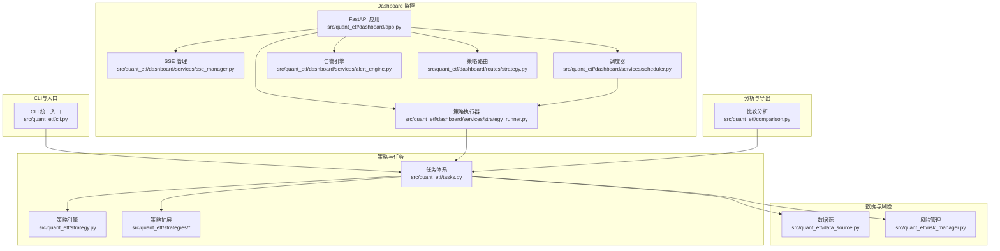
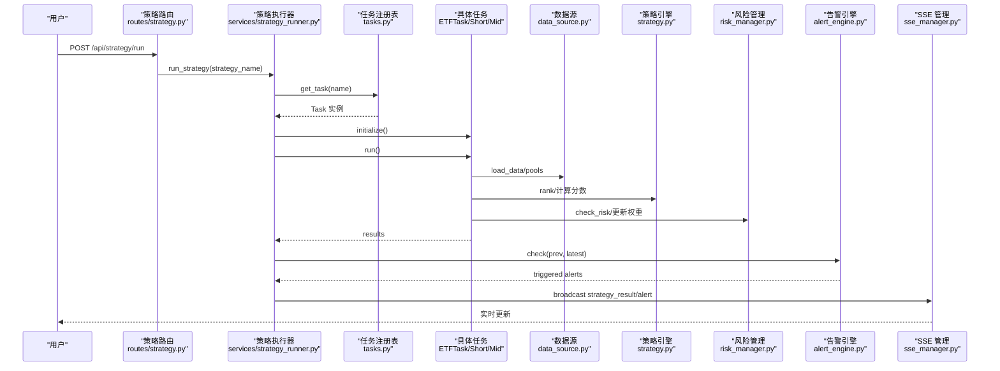
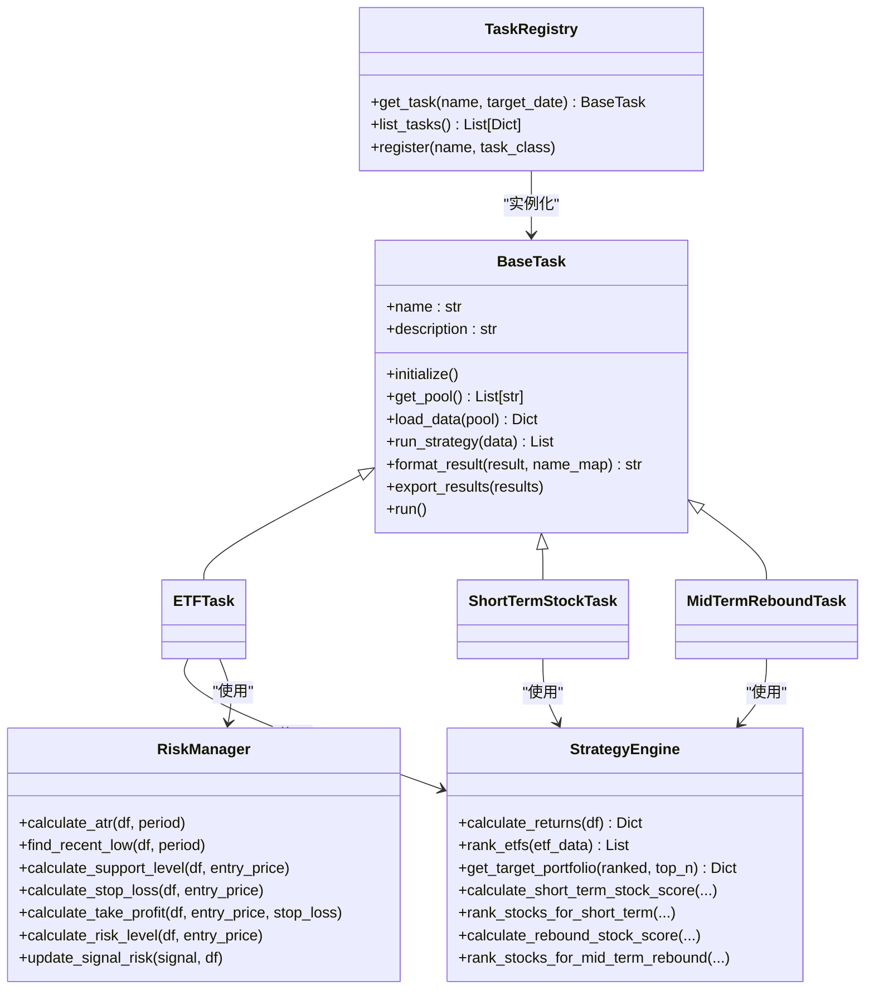
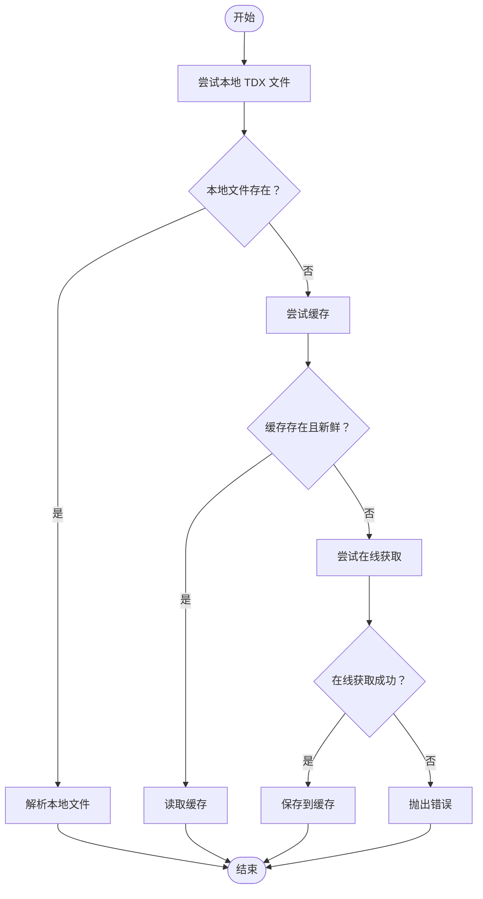
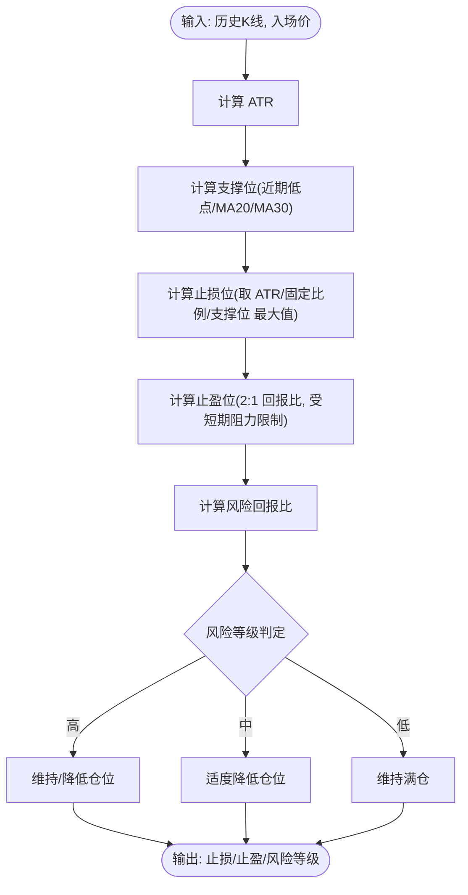
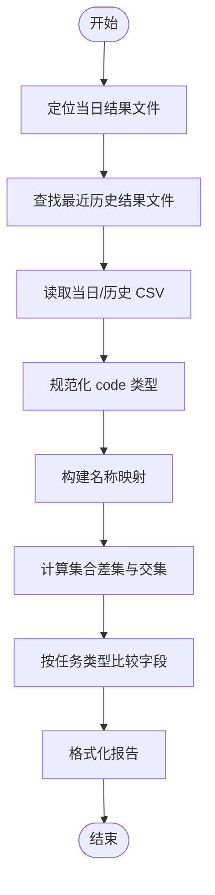
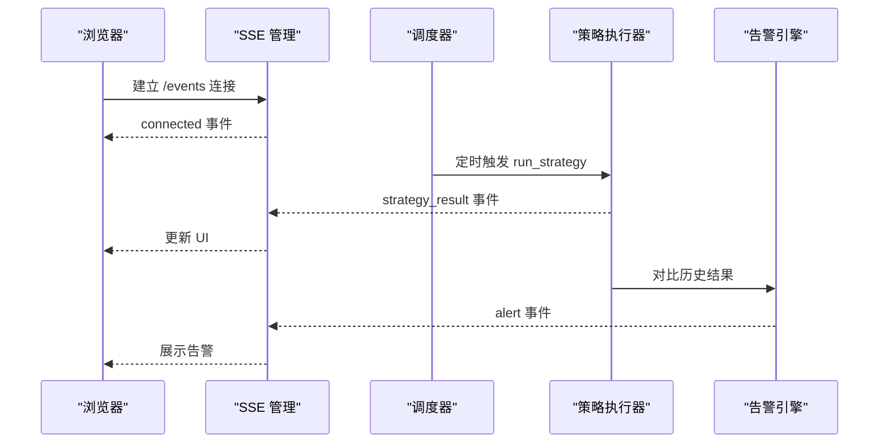
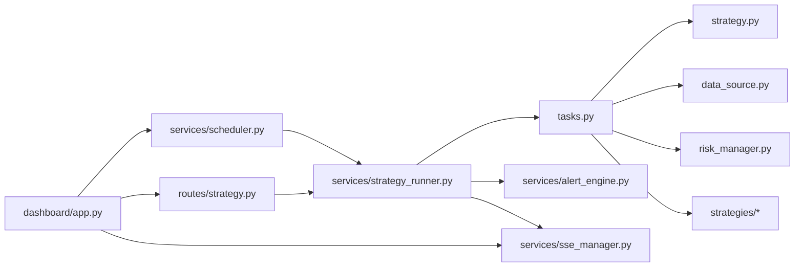

# 高级功能和扩展

<cite>
**本文引用的文件**
- [README.md](file://README.md)
- [src/quant_etf/__init__.py](file://src/quant_etf/__init__.py)
- [src/quant_etf/dashboard/app.py](file://src/quant_etf/dashboard/app.py)
- [src/quant_etf/risk_manager.py](file://src/quant_etf/risk_manager.py)
- [src/quant_etf/data_source.py](file://src/quant_etf/data_source.py)
- [src/quant_etf/strategy.py](file://src/quant_etf/strategy.py)
- [src/quant_etf/comparison.py](file://src/quant_etf/comparison.py)
- [src/quant_etf/dashboard/services/alert_engine.py](file://src/quant_etf/dashboard/services/alert_engine.py)
- [src/quant_etf/dashboard/services/scheduler.py](file://src/quant_etf/dashboard/services/scheduler.py)
- [src/quant_etf/dashboard/services/strategy_runner.py](file://src/quant_etf/dashboard/services/strategy_runner.py)
- [src/quant_etf/strategies/momentum_breakthrough.py](file://src/quant_etf/strategies/momentum_breakthrough.py)
- [src/quant_etf/strategies/volume_price.py](file://src/quant_etf/strategies/volume_price.py)
- [src/quant_etf/tasks.py](file://src/quant_etf/tasks.py)
- [src/quant_etf/dashboard/routes/strategy.py](file://src/quant_etf/dashboard/routes/strategy.py)
- [src/quant_etf/dashboard/services/sse_manager.py](file://src/quant_etf/dashboard/services/sse_manager.py)
</cite>

## 目录
1. [引言](#引言)
2. [项目结构](#项目结构)
3. [核心组件](#核心组件)
4. [架构总览](#架构总览)
5. [详细组件分析](#详细组件分析)
6. [依赖分析](#依赖分析)
7. [性能考虑](#性能考虑)
8. [故障排查指南](#故障排查指南)
9. [结论](#结论)
10. [附录](#附录)

## 引言
本文件面向高级用户与开发者，系统化阐述 Quant-ETF 的高级功能与扩展能力，重点覆盖：
- 策略扩展开发的方法与接口规范（含自定义策略的开发流程、测试验证与部署集成）
- 数据源扩展的技术实现与新数据源集成指南
- 风险管理系统的设计原理与实施方法
- 比较分析工具的使用方法与结果解读
- 系统监控与运维最佳实践（性能监控、日志管理、故障排查、系统维护）
- 面向定制化与二次开发的系统指导

## 项目结构
Quant-ETF 采用模块化与分层设计，CLI 统一入口调度任务；Dashboard 基于 FastAPI + HTMX 提供可视化监控；策略引擎与任务体系解耦，便于扩展。

图示来源
- [src/quant_etf/dashboard/app.py:17-25](file://src/quant_etf/dashboard/app.py#L17-L25)
- [src/quant_etf/tasks.py:30-160](file://src/quant_etf/tasks.py#L30-L160)
- [src/quant_etf/strategy.py:43-163](file://src/quant_etf/strategy.py#L43-L163)
- [src/quant_etf/data_source.py:15-381](file://src/quant_etf/data_source.py#L15-L381)
- [src/quant_etf/risk_manager.py:26-185](file://src/quant_etf/risk_manager.py#L26-L185)
- [src/quant_etf/comparison.py:8-129](file://src/quant_etf/comparison.py#L8-L129)
- [src/quant_etf/dashboard/services/sse_manager.py:10-45](file://src/quant_etf/dashboard/services/sse_manager.py#L10-L45)
- [src/quant_etf/dashboard/services/scheduler.py:15-82](file://src/quant_etf/dashboard/services/scheduler.py#L15-L82)
- [src/quant_etf/dashboard/services/strategy_runner.py:25-164](file://src/quant_etf/dashboard/services/strategy_runner.py#L25-L164)
- [src/quant_etf/dashboard/services/alert_engine.py:20-120](file://src/quant_etf/dashboard/services/alert_engine.py#L20-L120)
- [src/quant_etf/dashboard/routes/strategy.py:18-53](file://src/quant_etf/dashboard/routes/strategy.py#L18-L53)

章节来源
- [README.md:253-276](file://README.md#L253-L276)
- [src/quant_etf/dashboard/app.py:17-87](file://src/quant_etf/dashboard/app.py#L17-L87)

## 核心组件
- 任务体系与策略引擎：定义任务抽象、标准执行流程与策略打分排序逻辑，支持 ETF、短线、中期反弹三类任务。
- 数据源管理：统一加载本地 TDX 文件、缓存与在线数据，支持名称映射与缓存迁移。
- 风险管理：基于 ATR、均线与固定比例计算止损止盈与风险回报比，输出风险等级。
- Dashboard 监控：FastAPI + HTMX + SSE，提供策略执行、告警、市场状态等页面与 API。
- 策略扩展：内置动量突破与量价配合策略，支持注册新策略并接入任务体系。
- 比较分析：对比当日与历史结果，输出新增、退出与变化摘要。
- CLI 与入口：统一命令行入口，分发至各子命令与脚本。

章节来源
- [src/quant_etf/tasks.py:30-160](file://src/quant_etf/tasks.py#L30-L160)
- [src/quant_etf/strategy.py:43-321](file://src/quant_etf/strategy.py#L43-L321)
- [src/quant_etf/data_source.py:15-381](file://src/quant_etf/data_source.py#L15-L381)
- [src/quant_etf/risk_manager.py:26-185](file://src/quant_etf/risk_manager.py#L26-L185)
- [src/quant_etf/dashboard/app.py:17-87](file://src/quant_etf/dashboard/app.py#L17-L87)
- [src/quant_etf/strategies/momentum_breakthrough.py:46-187](file://src/quant_etf/strategies/momentum_breakthrough.py#L46-L187)
- [src/quant_etf/strategies/volume_price.py:16-186](file://src/quant_etf/strategies/volume_price.py#L16-L186)
- [src/quant_etf/comparison.py:8-129](file://src/quant_etf/comparison.py#L8-L129)

## 架构总览
Dashboard 采用 SSE 实时推送，策略执行器通过线程池调用任务注册表执行策略，调度器周期性触发执行并将结果广播给前端。

图示来源
- [src/quant_etf/dashboard/routes/strategy.py:24-31](file://src/quant_etf/dashboard/routes/strategy.py#L24-L31)
- [src/quant_etf/dashboard/services/strategy_runner.py:25-125](file://src/quant_etf/dashboard/services/strategy_runner.py#L25-L125)
- [src/quant_etf/tasks.py:411-450](file://src/quant_etf/tasks.py#L411-L450)
- [src/quant_etf/data_source.py:189-237](file://src/quant_etf/data_source.py#L189-L237)
- [src/quant_etf/strategy.py:103-163](file://src/quant_etf/strategy.py#L103-L163)
- [src/quant_etf/risk_manager.py:145-185](file://src/quant_etf/risk_manager.py#L145-L185)
- [src/quant_etf/dashboard/services/alert_engine.py:82-96](file://src/quant_etf/dashboard/services/alert_engine.py#L82-L96)
- [src/quant_etf/dashboard/services/sse_manager.py:34-41](file://src/quant_etf/dashboard/services/sse_manager.py#L34-L41)

## 详细组件分析

### 策略扩展开发与接口规范
- 扩展点
  - 新增策略类：实现分析函数与池分析函数，返回标准化信号对象。
  - 注册策略：在任务注册表中注册新任务名称与类，支持 CLI 与 Dashboard 调用。
  - 风险集成：在任务执行后调用风险管理器，按风险等级调整目标权重或阻断。
- 接口要点
  - 任务基类提供统一初始化、数据加载、策略运行、结果导出与格式化流程。
  - 策略引擎提供动量因子加权、排名与目标组合逻辑，可复用或替换。
  - Dashboard 通过路由与执行器暴露策略列表、启动与状态查询。
- 开发流程
  1) 设计策略类与信号模型，确保与现有数据结构兼容。
  2) 在任务注册表中注册新任务名称与类。
  3) 在 Dashboard 路由中暴露策略列表与执行接口。
  4) 编写单元/集成测试，验证数据加载、策略打分与导出。
  5) 部署到生产环境，通过 CLI 或 Dashboard 触发执行并观察 SSE 实时结果。

图示来源
- [src/quant_etf/tasks.py:30-160](file://src/quant_etf/tasks.py#L30-L160)
- [src/quant_etf/tasks.py:162-450](file://src/quant_etf/tasks.py#L162-L450)
- [src/quant_etf/strategy.py:43-321](file://src/quant_etf/strategy.py#L43-L321)
- [src/quant_etf/risk_manager.py:26-185](file://src/quant_etf/risk_manager.py#L26-L185)

章节来源
- [src/quant_etf/tasks.py:30-160](file://src/quant_etf/tasks.py#L30-L160)
- [src/quant_etf/tasks.py:411-450](file://src/quant_etf/tasks.py#L411-L450)
- [src/quant_etf/strategy.py:43-163](file://src/quant_etf/strategy.py#L43-L163)
- [src/quant_etf/risk_manager.py:26-185](file://src/quant_etf/risk_manager.py#L26-L185)
- [src/quant_etf/dashboard/routes/strategy.py:18-53](file://src/quant_etf/dashboard/routes/strategy.py#L18-L53)

### 数据源扩展与新数据源集成指南
- 当前数据源优先级：本地 TDX 文件 → 缓存 → 在线获取；支持 ETF 与股票两类数据。
- 扩展步骤
  1) 在数据源类中新增加载函数，遵循现有优先级与缓存策略。
  2) 若需名称映射，完善名称映射缓存与加载逻辑。
  3) 在任务中注入新数据源并更新池选择逻辑。
  4) 编写测试覆盖数据加载、缓存命中与新鲜度校验。
- 关键接口
  - 加载 ETF/股票数据：load_data/load_stock_data
  - 缓存路径与迁移：get_cache_path/get_stock_cache_path
  - 新鲜度校验：check_is_fresh
  - 名称映射：get_etf_name_map/get_stock_name_map

图示来源
- [src/quant_etf/data_source.py:189-237](file://src/quant_etf/data_source.py#L189-L237)
- [src/quant_etf/data_source.py:238-285](file://src/quant_etf/data_source.py#L238-L285)
- [src/quant_etf/data_source.py:151-188](file://src/quant_etf/data_source.py#L151-L188)

章节来源
- [src/quant_etf/data_source.py:15-381](file://src/quant_etf/data_source.py#L15-L381)

### 风险管理系统设计与实施
- 设计原则
  - 基于技术位止损（近期低点、均线、ATR）与固定比例止损的综合策略。
  - 以盈亏比与风险回报比评估风险等级，指导仓位调整。
- 实施要点
  - ATR 计算与滚动窗口校验，防止 NaN/Inf。
  - 支撑位选择：近期低点、MA20/MA30，取有效且小于入场价的最低值。
  - 止损位取 ATR 止损、固定比例与支撑位的最大值，止盈按 2:1 回报比并受短期阻力限制。
  - 风险等级：≥2.0 高，[1.5,2.0) 中，<1.5 低。
- 集成方式
  - 在 ETF 任务中加载风险状态，按等级调整目标权重或阻断。
  - 在策略扩展中，可将风险信息注入信号对象，供 Dashboard 展示。

图示来源
- [src/quant_etf/risk_manager.py:104-171](file://src/quant_etf/risk_manager.py#L104-L171)
- [src/quant_etf/tasks.py:195-213](file://src/quant_etf/tasks.py#L195-L213)

章节来源
- [src/quant_etf/risk_manager.py:26-185](file://src/quant_etf/risk_manager.py#L26-L185)
- [src/quant_etf/tasks.py:195-213](file://src/quant_etf/tasks.py#L195-L213)

### 比较分析工具使用与结果解读
- 功能概述
  - 对比当日任务结果与历史最近一次结果，输出新增、退出与变化摘要。
  - 自动加载 ETF/股票名称映射，提升可读性。
- 使用方法
  - 通过比较器定位历史 CSV，读取当日与历史 DataFrame，按 code 去重与对齐。
  - 根据任务类型比较目标权重或评分，输出格式化报告。
- 结果解读
  - 新增：当日出现而历史不存在的标的，提示关注。
  - 退出：历史存在而当日不存在的标的，提示离场。
  - 变化：共同标的的权重/评分变动，阈值过滤微小波动。

图示来源
- [src/quant_etf/comparison.py:37-129](file://src/quant_etf/comparison.py#L37-L129)

章节来源
- [src/quant_etf/comparison.py:8-129](file://src/quant_etf/comparison.py#L8-L129)

### Dashboard 监控与实时推送
- SSE 机制
  - 每个客户端连接维护独立队列，初始广播连接事件，心跳保活。
  - 策略执行完成后广播结果事件，错误事件同样广播。
- 调度与执行
  - 调度器读取启用的计划，周期性触发策略执行器。
  - 执行器在后台线程执行任务，完成后对比历史结果触发告警并广播。
- 告警规则
  - 评分进入前三、动量得分突变、持仓偏离目标（预留）。
  - 告警生命周期：active → acknowledged → resolved。

图示来源
- [src/quant_etf/dashboard/services/sse_manager.py:14-41](file://src/quant_etf/dashboard/services/sse_manager.py#L14-L41)
- [src/quant_etf/dashboard/services/scheduler.py:19-52](file://src/quant_etf/dashboard/services/scheduler.py#L19-L52)
- [src/quant_etf/dashboard/services/strategy_runner.py:72-101](file://src/quant_etf/dashboard/services/strategy_runner.py#L72-L101)
- [src/quant_etf/dashboard/services/alert_engine.py:30-96](file://src/quant_etf/dashboard/services/alert_engine.py#L30-L96)

章节来源
- [src/quant_etf/dashboard/app.py:39-50](file://src/quant_etf/dashboard/app.py#L39-L50)
- [src/quant_etf/dashboard/services/sse_manager.py:10-45](file://src/quant_etf/dashboard/services/sse_manager.py#L10-L45)
- [src/quant_etf/dashboard/services/scheduler.py:15-82](file://src/quant_etf/dashboard/services/scheduler.py#L15-L82)
- [src/quant_etf/dashboard/services/strategy_runner.py:25-164](file://src/quant_etf/dashboard/services/strategy_runner.py#L25-L164)
- [src/quant_etf/dashboard/services/alert_engine.py:20-120](file://src/quant_etf/dashboard/services/alert_engine.py#L20-L120)

## 依赖分析
- 组件耦合
  - 任务体系与策略引擎、数据源、风险管理强耦合，便于扩展与替换。
  - Dashboard 通过路由与执行器解耦业务逻辑，仅依赖任务注册表与 SSE。
- 外部依赖
  - FastAPI/uvicorn、loguru、pandas/numpy、duckdb/sqlite 等。
- 循环依赖
  - 未发现直接循环导入；策略扩展通过注册表间接依赖任务体系。

图示来源
- [src/quant_etf/tasks.py:13-27](file://src/quant_etf/tasks.py#L13-L27)
- [src/quant_etf/dashboard/services/strategy_runner.py:15-19](file://src/quant_etf/dashboard/services/strategy_runner.py#L15-L19)
- [src/quant_etf/dashboard/routes/strategy.py:9-13](file://src/quant_etf/dashboard/routes/strategy.py#L9-L13)
- [src/quant_etf/dashboard/app.py:13-15](file://src/quant_etf/dashboard/app.py#L13-L15)

章节来源
- [src/quant_etf/tasks.py:13-27](file://src/quant_etf/tasks.py#L13-L27)
- [src/quant_etf/dashboard/services/strategy_runner.py:15-19](file://src/quant_etf/dashboard/services/strategy_runner.py#L15-L19)
- [src/quant_etf/dashboard/routes/strategy.py:9-13](file://src/quant_etf/dashboard/routes/strategy.py#L9-L13)
- [src/quant_etf/dashboard/app.py:13-15](file://src/quant_etf/dashboard/app.py#L13-L15)

## 性能考虑
- 数据加载
  - 优先本地 TDX 文件与缓存，减少在线请求；缓存路径与迁移逻辑保证一致性。
  - 新鲜度校验避免盘前/盘后无效数据参与计算。
- 策略执行
  - 使用线程池执行耗时任务，避免阻塞事件循环；SSE 广播仅在完成或出错时触发。
  - 策略引擎对权重归一化，避免极端因子主导。
- Dashboard
  - SSE 心跳保活，避免长时间空闲断开；前端使用 HTMX 无刷新更新。
- 建议
  - 对高频数据（分钟线）建议使用 DuckDB 并定期重采样，降低内存压力。
  - 对大规模池扫描，建议分批加载与并行处理，结合进度上报。

## 故障排查指南
- Dashboard 启动/健康检查
  - 使用 CLI 健康检查端点验证各页面路由可达；必要时重启服务。
- 策略执行失败
  - 查看执行器错误广播与日志；确认任务名称正确、池数据可加载。
- 数据加载失败
  - 检查本地 TDX 路径、缓存文件权限与日期格式；必要时启用在线回退。
- 告警未触发
  - 确认历史结果存在且可读；检查告警规则阈值与字段匹配。
- 日志管理
  - 使用 loguru 默认配置；生产环境建议集中化收集与分级存储。

章节来源
- [README.md:176-188](file://README.md#L176-L188)
- [src/quant_etf/dashboard/app.py:68-72](file://src/quant_etf/dashboard/app.py#L68-L72)
- [src/quant_etf/dashboard/services/strategy_runner.py:102-122](file://src/quant_etf/dashboard/services/strategy_runner.py#L102-L122)
- [src/quant_etf/data_source.py:189-237](file://src/quant_etf/data_source.py#L189-L237)
- [src/quant_etf/dashboard/services/alert_engine.py:82-96](file://src/quant_etf/dashboard/services/alert_engine.py#L82-L96)

## 结论
Quant-ETF 提供了清晰的任务-策略-数据-风险解耦架构，配合 Dashboard 的 SSE 实时监控与告警机制，既满足日常自动化选股需求，也为高级用户提供了完善的扩展与定制空间。通过策略注册表、数据源抽象与风险管理模块，用户可快速实现新策略、接入新数据源并纳入统一监控体系。

## 附录
- CLI 与命令参考：参见项目自述文件中的命令与参数说明。
- Dashboard 页面与 API：参见项目自述文件中的页面与路由清单。
- 配置项：动量权重、持仓数量、SSE 心跳间隔等，参见项目自述文件与相关配置文件。

章节来源
- [README.md:70-188](file://README.md#L70-L188)
- [README.md:395-436](file://README.md#L395-L436)