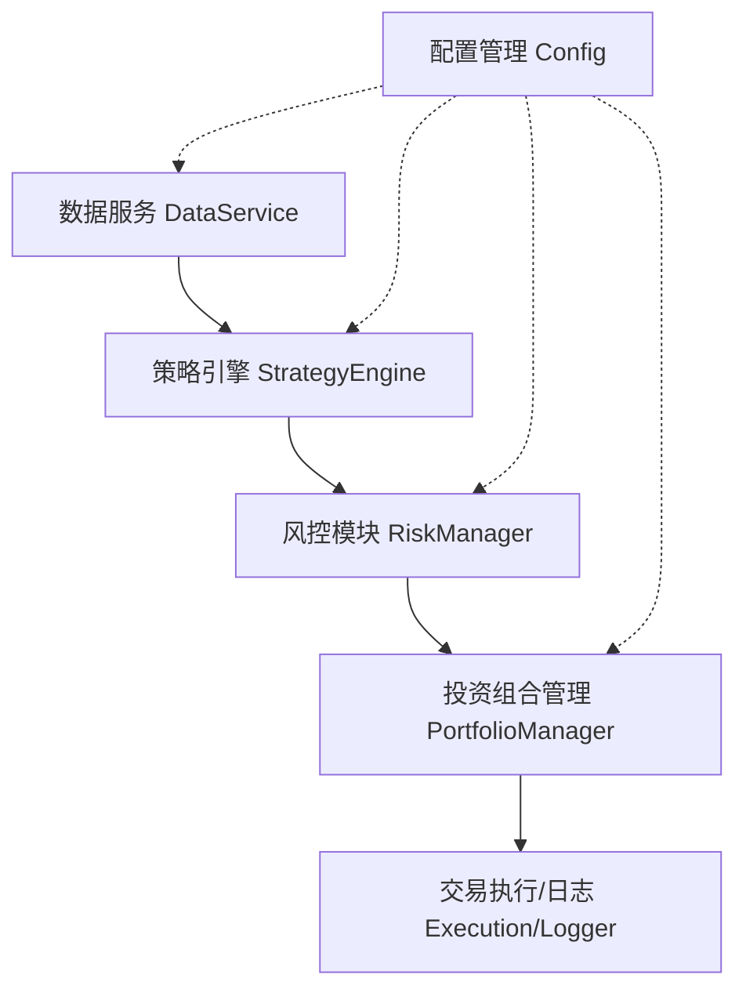

# 量化ETF轮动与风控系统 - 设计方案

## 1. 系统概述
本项目旨在构建一个针对50支场内ETF的量化投资系统。该系统基于动量策略（不同周期的涨幅）进行动态仓位管理，并结合市场风险监测机制，在保证收益的同时最大程度控制回撤。

## 2. 核心需求分析
1.  **投资标的**：50支覆盖宽基、行业、主题的场内ETF。
2.  **核心因子**：60日、20日、10日、5日涨幅。
3.  **交易执行**：
    *   仓位调整不是瞬间完成，而是在2-4周内平滑过渡（或按此周期Rebalance）。
4.  **风险控制**：
    *   监测“高位风险区”。
    *   监测“下跌趋势”。
    *   动作：立即调整（减仓/清仓）。

## 3. 系统架构设计

系统采用模块化分层架构，主要包含以下模块：



### 3.1 模块详细设计

#### 3.1.1 数据服务 (DataService)
*   **功能**：负责获取ETF历史行情数据（OHLCV）。
*   **数据源**：`akshare` (首选，免费开源) 或 `tushare`。
*   **处理**：
    *   清洗数据（处理停牌、除权除息）。
    *   本地缓存（Parquet/CSV），避免重复请求。
    *   提供统一的数据查询接口 `get_price_history(code, start_date, end_date)`。

#### 3.1.2 策略引擎 (StrategyEngine)
*   **功能**：计算信号与目标仓位。
*   **逻辑**：
    *   **因子计算**：计算每支ETF的 `Return_60d`, `Return_20d`, `Return_10d`, `Return_5d`。
    *   **打分模型**：
        *   加权得分 `Score = w1*R60 + w2*R20 + w3*R10 + w4*R5`。
        *   或排名模型：按综合得分对50支ETF排序。
    *   **仓位分配**：
        *   选出头部 N 支（例如前5-10支）进行持仓。
        *   或者根据得分计算权重 `Weight_i`。

#### 3.1.3 风控模块 (RiskManager)
*   **功能**：独立于策略引擎，具有“一票否决权”。
*   **高位判断 (High Risk Zone)**：
    *   指标：历史分位数（Price Percentile > 85%）、RSI > 80、乖离率 (Bias) 过大。
*   **趋势破坏 (Trend Breakdown)**：
    *   指标：跌破 MA20 或 MA60，或 MACD 死叉。
*   **风控信号**：
    *   `RiskLevel`: LOW, MEDIUM, HIGH, CRITICAL。
    *   当 Level >= HIGH 时，强制降低目标仓位（例如降至 0 或 20%）。

#### 3.1.4 投资组合管理 (PortfolioManager)
*   **功能**：计算当前持仓与目标持仓的差异，生成调仓计划。
*   **平滑执行逻辑**：
    *   需求要求“2周到4周完成调整”。
    *   **方案 A (定期调仓)**：每 2-4 周运行一次策略，一次性调仓。
    *   **方案 B (平滑建仓)**：策略每日运行，但资金分成 N 份（例如 10 份），每天只调整 1/N 的仓位，平滑市场波动。
    *   *推荐方案*：结合两者。正常情况下每 2 周 Rebalance 一次；触发风控时立即执行。

#### 3.1.5 日志与监控 (Logger)
*   使用 `loguru` 记录运行日志、信号生成、交易指令。
*   输出关键指标：当前总资产、持仓详情、最新风控状态。

## 4. 关键算法逻辑

### 4.1 综合动量评分 (Momentum Score)
```python
def calculate_score(df):
    # 归一化各周期涨幅，防止长周期涨幅数值过大主导权重
    norm_r60 = normalize(df['pct_chg_60'])
    norm_r20 = normalize(df['pct_chg_20'])
    norm_r10 = normalize(df['pct_chg_10'])
    norm_r5 = normalize(df['pct_chg_5'])
    
    # 权重配置 (可配置)
    score = 0.4 * norm_r60 + 0.3 * norm_r20 + 0.2 * norm_r10 + 0.1 * norm_r5
    return score
```

### 4.2 风控触发逻辑
```python
def check_risk(price_series):
    # 1. 判断是否高位
    is_high_position = price_series[-1] > price_series.quantile(0.85)
    
    # 2. 判断是否开始下跌 (例如跌破20日线)
    ma20 = price_series.rolling(20).mean()
    is_breaking_down = price_series[-1] < ma20[-1] and price_series[-2] > ma20[-2]
    
    if is_high_position and is_breaking_down:
        return RiskAction.REDUCE_POSITION_IMMEDIATELY
    return RiskAction.NORMAL
```

## 5. 技术栈选型
*   **语言**: Python 3.12+
*   **包管理**: `uv`
*   **数据**: `akshare`, `pandas`
*   **计算**: `numpy`, `scipy`
*   **日志**: `loguru`
*   **测试**: `pytest`

## 6. 开发计划 (Roadmap)
1.  **环境准备**：配置 `pyproject.toml`，安装依赖。
2.  **数据层开发**：实现 ETF 列表管理和 K 线获取。
3.  **策略层开发**：实现涨幅计算和打分逻辑。
4.  **风控层开发**：实现高位下跌检测。
5.  **回测/模拟**：编写主循环，模拟一段时间的运行，验证逻辑。
6.  **完善测试**：添加单元测试。
