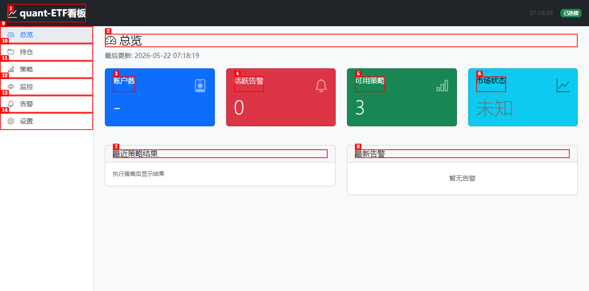
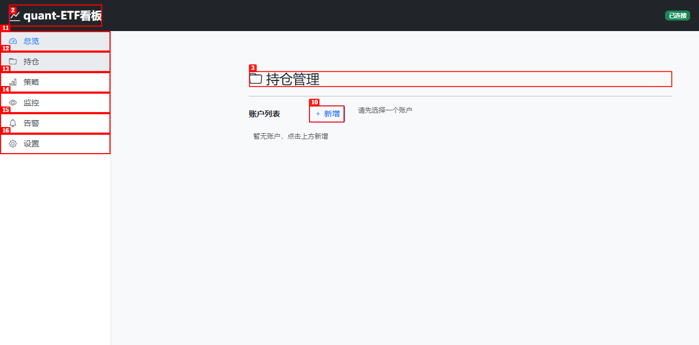
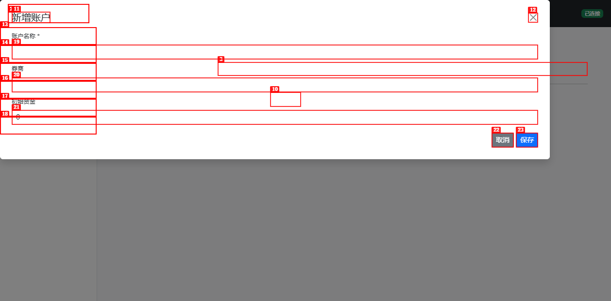
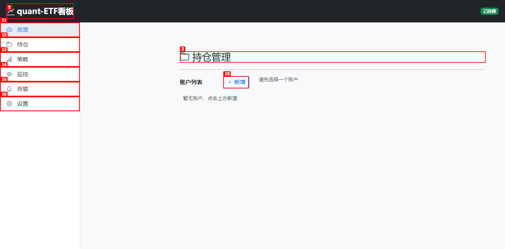
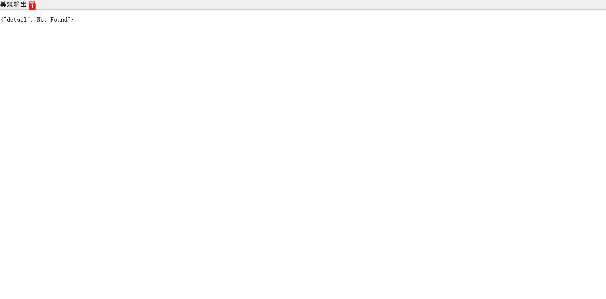
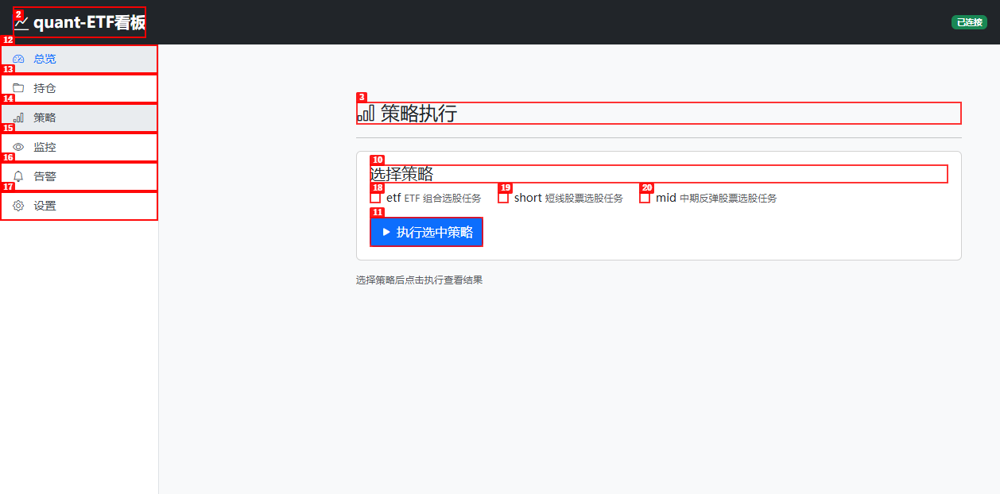
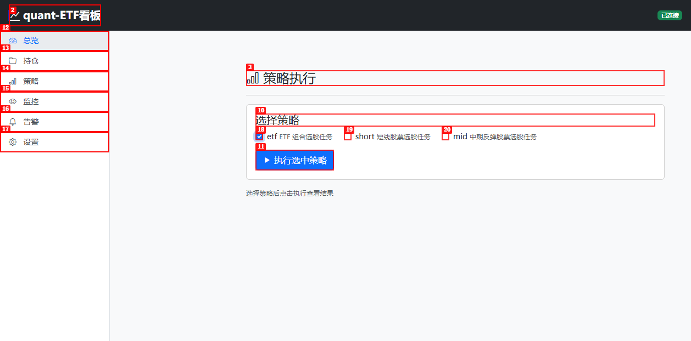
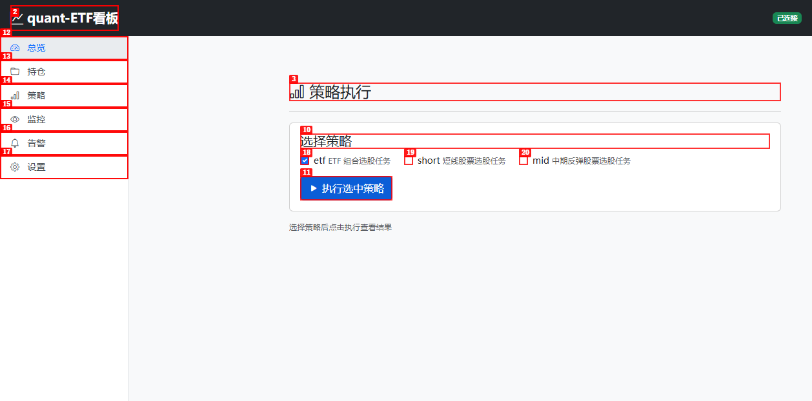

# Dogfood Report: 量化ETF看板

| Field | Value |
|-------|-------|
| **Date** | 2026-05-22 |
| **App URL** | http://127.0.0.1:8080 |
| **Session** | quant-etf-dashboard |
| **Scope** | 全页面探索性测试：总览、持仓、策略、监控、告警、设置 |

## Summary

| Severity | Count |
|----------|-------|
| Critical | 1 |
| High | 2 |
| Medium | 2 |
| Low | 2 |
| **Total** | **7** |

## Issues

### ISSUE-001: HTMX 页面导航导致导航栏和侧边栏重复嵌套

| Field | Value |
|-------|-------|
| **Severity** | critical |
| **Category** | functional |
| **URL** | 所有子页面（持仓、策略、监控、告警、设置） |
| **Repro Video** | N/A |

**Description**

通过侧边栏 HTMX 导航跳转到任何子页面（持仓、策略、监控、告警、设置）后，页面内容区域内会出现**重复的顶部导航栏和侧边栏**。DOM 结构显示 `<main>` 内嵌套了第二层 `<nav>` + 侧边栏 `<ul>`，导致页面布局混乱。

**根因**：`/pages/*` 路由返回完整的 `base.html` 模板（包含 navbar + sidebar + content），而侧边栏的 `hx-get="/pages/xxx" hx-target="#content"` 只期望注入内容片段。结果完整的 base 模板被嵌套注入到 `#content` div 中。

**Repro Steps**

1. 导航到 http://127.0.0.1:8080/pages/overview（直接加载，正常）
   

2. 点击侧边栏"持仓"链接（HTMX 动态加载）
   

3. **观察**：内容区域出现重复的导航栏和侧边栏，DOM 中可见两组 nav 链接
   

**预期行为**：侧边栏导航应仅替换 `#content` 区域的内容，不包含导航栏和侧边栏。

**修复建议**：将 `/pages/*` 路由改为返回纯内容片段（不继承 `base.html`），或为 HTMX 请求检测 `HX-Request` 头并返回不同的模板。

---

### ISSUE-002: 浏览器控制台出现 htmx:syntax:error

| Field | Value |
|-------|-------|
| **Severity** | high |
| **Category** | console |
| **URL** | http://127.0.0.1:8080/pages/overview |
| **Repro Video** | N/A |

**Description**

总览页面加载后，浏览器控制台出现 3 个 `htmx:syntax:error` 错误。这些错误表明 HTMX 在解析页面中的某些属性时遇到语法问题，可能导致相关 HTMX 功能（如自动刷新、事件触发等）失效。

**Repro Steps**

1. 导航到 http://127.0.0.1:8080/pages/overview
   

2. 打开浏览器控制台
3. **观察**：3 个 `htmx:syntax:error` 错误

**预期行为**：控制台不应有 HTMX 语法错误。

**修复建议**：检查 `index.html` 模板中的 HTMX 属性（`hx-get`, `hx-trigger`, `hx-target` 等），确保所有表达式语法正确。

---

### ISSUE-003: 新增账户提交返回 422 Unprocessable Entity

| Field | Value |
|-------|-------|
| **Severity** | high |
| **Category** | functional |
| **URL** | http://127.0.0.1:8080/pages/portfolio |
| **Repro Video** | N/A |

**Description**

在持仓页面点击"新增"按钮，填写账户名称"测试账户"、券商"华泰证券"、初始资金"100000"后点击"保存"，服务器返回 HTTP 422。账户未创建成功，列表仍显示"暂无账户"。

**服务器日志**：`POST /api/portfolio/accounts HTTP/1.1 422 Unprocessable Entity`

**Repro Steps**

1. 导航到持仓页面
   

2. 点击"新增"按钮，弹出新增账户对话框
   

3. 填写表单（账户名称、券商、初始资金），点击"保存"
   

4. **观察**：弹窗关闭，但账户列表仍显示"暂无账户"，服务器日志显示 422 错误
   

**预期行为**：表单提交后应成功创建账户，列表中显示新账户。

**修复建议**：检查 `POST /api/portfolio/accounts` 的请求体格式。表单可能以 `application/x-www-form-urlencoded` 提交，但 API 期望 JSON 格式（FastAPI 的 Pydantic model 需要 JSON body）。需要在前端用 JS 收集表单数据并以 JSON 方式提交，或改用 `Form` 参数接收。

---

### ISSUE-004: 根路径 "/" 返回 404 Not Found

| Field | Value |
|-------|-------|
| **Severity** | medium |
| **Category** | ux |
| **URL** | http://127.0.0.1:8080/ |
| **Repro Video** | N/A |

**Description**

直接访问 http://127.0.0.1:8080/ 返回 JSON 格式的 `{"detail":"Not Found"}`，而非自动重定向到总览页面。

**Repro Steps**

1. 在浏览器地址栏输入 http://127.0.0.1:8080/
2. **观察**：页面显示 `{"detail":"Not Found"}`
   

**预期行为**：根路径应自动重定向到 `/pages/overview`。

**修复建议**：在 `app.py` 中添加根路径重定向：
```python
from fastapi.responses import RedirectResponse

@app.get("/")
async def root():
    return RedirectResponse(url="/pages/overview")
```

---

### ISSUE-005: 策略执行后状态卡在"执行中..."

| Field | Value |
|-------|-------|
| **Severity** | medium |
| **Category** | functional |
| **URL** | http://127.0.0.1:8080/pages/strategy |
| **Repro Video** | N/A |

**Description**

在策略页面勾选"ETF 组合选股任务"并点击"执行选中策略"后，页面显示"执行中..."但一直没有更新为执行结果。等待超过 30 秒后状态文字仍然停留在"执行中..."。

**Repro Steps**

1. 导航到策略页面
   

2. 勾选"ETF 组合选股任务"复选框
   

3. 点击"执行选中策略"按钮
4. **观察**：显示"执行中..."但不会更新为结果
   

**预期行为**：执行完成后应显示策略结果表格或图表。

**修复建议**：检查前端轮询机制（`/api/strategy/status/{run_id}`）是否正常工作。可能是轮询间隔设置问题或 run_id 未正确返回。

---

### ISSUE-006: 总览页账户数显示"-"而非"0"

| Field | Value |
|-------|-------|
| **Severity** | low |
| **Category** | content |
| **URL** | http://127.0.0.1:8080/pages/overview |
| **Repro Video** | N/A |

**Description**

总览页面的"账户数"指标卡片显示"-"而非数字"0"。当没有账户时，应显示 0 而非占位符。

**Repro Steps**

1. 导航到总览页面
2. **观察**："账户数"卡片内容显示"-"
   

**预期行为**：无账户时应显示"0"。

**修复建议**：检查 `/api/market/overview` 返回的 `account_count` 字段，确保无账户时返回 0 而非 null/undefined。前端模板也应对 null 做兜底处理。

---

### ISSUE-007: favicon.ico 返回 404

| Field | Value |
|-------|-------|
| **Severity** | low |
| **Category** | console |
| **URL** | http://127.0.0.1:8080/favicon.ico |
| **Repro Video** | N/A |

**Description**

浏览器自动请求 `/favicon.ico` 时返回 404，在控制台和网络面板中产生一条错误记录。

**服务器日志**：`GET /favicon.ico HTTP/1.1 404 Not Found`

**Repro Steps**

1. 访问任意页面
2. **观察**：浏览器控制台/网络面板显示 `favicon.ico` 404

**预期行为**：提供一个 favicon 或返回 204 No Content。

**修复建议**：在 `base.html` 的 `<head>` 中添加 favicon 链接，或在 FastAPI 中添加一个 favicon 路由返回空响应。

